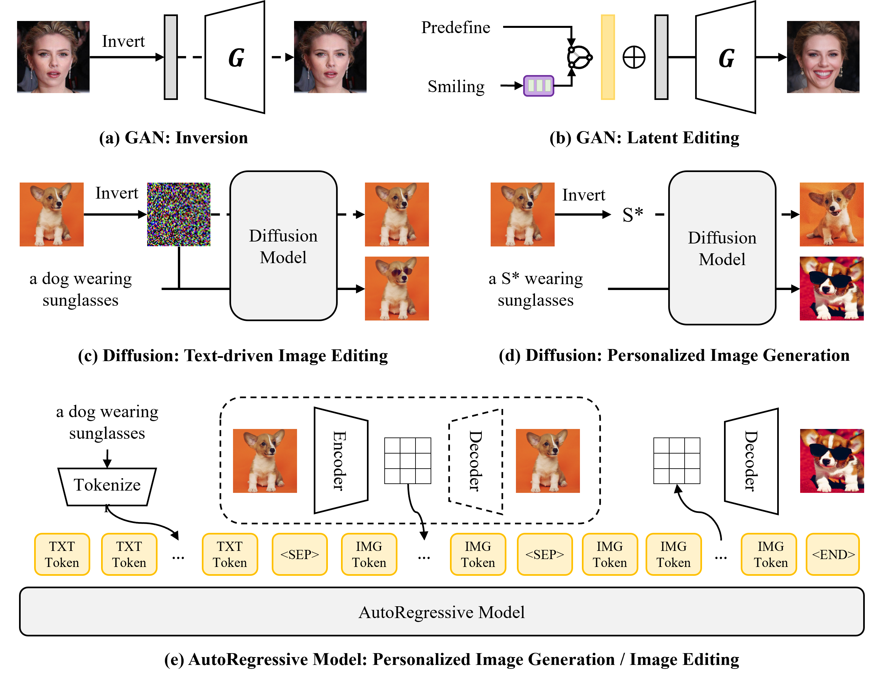
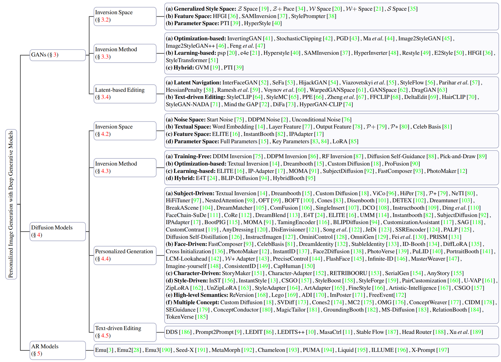

# Personalization Image Generation with Generative Models

This repo is used for recording and tracking recent personalized image generation with different generative models. For more detailed information, please refer to our survey paper: [Personalized Image Generation with Deep Generative Models: A Decade Survey](https://arxiv.org/pdf/2502.13081).

## Contents

- [Personalization with Diffusion Models](#Personalization-with-Diffusion-Models)
    - [Subject-Driven Generation](#Subject-Driven-Generation)
    - [Face-Driven Generation](#Face-Driven-Generation)
    - [Character-Driven Generation](#Character-Driven-Generation)
    - [Style-Driven Generation](#Style-Driven-Generation)
    - [High-level Semantics Generation](#High-level-Semantics-Generation)
    - [Multiple Concepts Generation](#Multiple-Concepts-Generation)
    - [Text-driven Image Editing](#Text-driven-Image-Editing)
    - [Personalized Video Generation](#Personalized-Video-Generation)
    - [Personalized 3D Generation](#Personalized-3D-Generation)
- [Personalization with AR Models](#Personalization-with-AR-Models)
- [Personalization with GANs](#Personalization-with-GANs)
  - [GAN Inversion](#GAN-Inversion)
  - [Latent Editing](#Latent-Editing)
- [Related Surveys](#Related-Surveys)

## Personalization with Diffusion Models

### Subject-Driven Generation

**ACCORD: Alleviating Concept Coupling through Dependence Regularization for Text-to-Image Diffusion Personalization** 
*Shizhan Liu, Hao Zheng, Hang Yu, Jianguo Li* 
Arxiv 2025. / [PDF](https://www.arxiv.org/abs/2503.01122)

**Generating Multi-Image Synthetic Data for Text-to-Image Customization** 
*Nupur Kumari, Xi Yin, Jun-Yan Zhu, Ishan Misra, Samaneh Azadi* 
Arxiv 2025. / [PDF](https://arxiv.org/abs/2502.01720) / [Project](https://www.cs.cmu.edu/~syncd-project/) / [Code](https://github.com/nupurkmr9/syncd)

**Beyond Fine-Tuning: A Systematic Study of Sampling Techniques in Personalized Image Generation** 
*Vera Soboleva, Maksim Nakhodnov, Aibek Alanov* 
Arxiv 2025. / [PDF](https://arxiv.org/abs/2502.05895) 

**Nested Attention: Semantic-aware Attention Values for Concept Personalization** 
*Patashnik, Or and Gal, Rinon and Ostashev, Daniil and Tulyakov, Sergey and Aberman, Kfir and Cohen-Or, Daniel.* 
Arxiv 2025.  / [PDF](https://arxiv.org/abs/2501.01407)  / [Project](https://snap-research.github.io/NestedAttention/)

**AnyDressing: Customizable Multi-Garment Virtual Dressing via Latent Diffusion Models** 
*Li, Xinghui and Sun, Qichao and Zhang, Pengze and Ye, Fulong and Liao, Zhichao and Feng, Wanquan and Zhao, Songtao and He, Qian.* 
CVPR 2025.  / [PDF](https://arxiv.org/abs/2412.04146)  / [Project](https://crayon-shinchan.github.io/AnyDressing/)  / [Code](https://github.com/Crayon-Shinchan/AnyDressing)

**Customized Generation Reimagined: Fidelity and Editability Harmonized** 
*Jin, Jian and Shen, Yang and Fu, Zhenyong and Yang, Jian.* 
ECCV 2024.  / [PDF](https://arxiv.org/abs/2412.04831v1)  / [Code](https://github.com/jinjianRick/DCI_ICO)

**P3S-Diffusion: A Selective Subject-driven Generation Framework via Point Supervision** 
*Hu, Junjie and Gao, Shuyong and Hong, Lingyi and Wang, Qishan and Zhao, Yuzhou and Wang, Yan and Zhang, Wenqiang.* 
Arxiv 2024.  / [PDF](https://arxiv.org/abs/2412.19533)

**Large-Scale Text-to-Image Model with Inpainting is a Zero-Shot Subject-Driven Image Generator** 
*Shin, Chaehun and Choi, Jooyoung and Kim, Heeseung and Yoon, Sungroh.* 
Arxiv 2024.  / [PDF](https://arxiv.org/abs/2411.15466)  / [Project](https://diptychprompting.github.io/)

**DreamCache: Finetuning-Free Lightweight Personalized Image Generation via Feature Caching** 
*Aiello, Emanuele and Michieli, Umberto and Valsesia, Diego and Ozay, Mete and Magli, Enrico.* 
Arxiv 2024.  / [PDF](https://arxiv.org/abs/2411.17786)  / [Project](https://emanuele97x.github.io/DreamCache/)  / [Code](https://github.com/Emanuele97x/DreamCache)

**Diffusion Self-Distillation for Zero-Shot Customized Image Generation** 
*Cai, Shengqu and Chan, Eric and Zhang, Yunzhi and Guibas, Leonidas and Wu, Jiajun and Wetzstein, Gordon.* 
CVPR 2025.  / [PDF](https://arxiv.org/abs/2411.18616)  / [Project](https://primecai.github.io/dsd/) / [Code](https://github.com/primecai/diffusion-self-distillation)

**DreamBlend: Advancing personalized fine-tuning of text-to-image diffusion models** 
*Ram, Shwetha and Neiman, Tal and Feng, Qianli and Stuart, Andrew and Tran, Son and Chilimbi, Trishul.* 
WACV 2025.  / [PDF](https://arxiv.org/abs/2411.19390v1)

**OminiControl: Minimal and Universal Control for Diffusion Transformer** 
*Tan, Zhenxiong and Liu, Songhua and Yang, Xingyi and Xue, Qiaochu and Wang, Xinchao.* 
Arxiv 2024.  / [PDF](https://arxiv.org/abs/2411.15098)  / [Code](https://github.com/Yuanshi9815/OminiControl)

**One Diffusion to Generate Them All** 
*Le, Duong H. and Pham, Tuan and Lee, Sangho and Clark, Christopher and Kembhavi, Aniruddha and Mandt, Stephan and Krishna, Ranjay and Lu, Jiasen.* 
Arxiv 2024.  / [PDF](https://arxiv.org/abs/2411.16318v1)  / [Project](https://lehduong.github.io/OneDiffusion-homepage/)  / [Code](https://github.com/lehduong/OneDiffusion)

**Cusconcept: Customized visual concept decomposition with diffusion models** 
*Xu, Zhi and Hao, Shaozhe and Han, Kai.* 
WACV 2025.  / [PDF](https://arxiv.org/abs/2410.00398)  / [Code](https://github.com/xzLcan/CusConcept)

**DisEnvisioner: Disentangled and Enriched Visual Prompt for Customized Image Generation** 
*He, Jing and Li, Haodong and Hu, Yongzhe and Shen, Guibao and Cai, Yingjie and Qiu, Weichao and Chen, Ying-Cong.* 
ICLR 2025.  / [PDF](https://arxiv.org/abs/2410.02067)  / [Project](https://disenvisioner.github.io/)  / [Code](https://github.com/EnVision-Research/DisEnvisioner)

**HybridBooth: Hybrid Prompt Inversion for Efficient Subject-Driven Generation** 
*Guan, Shanyan and Ge, Yanhao and Tai, Ying and Yang, Jian and Li, Wei and You, Mingyu.* 
ECCV 2024.  / [PDF](https://arxiv.org/abs/2410.08192v1)  / [Project](https://sites.google.com/view/hybridbooth)

**Learning to Customize Text-to-Image Diffusion In Diverse Context** 
*Kim, Taewook and Chen, Wei and Qiu, Qiang.* 
Arxiv 2024.  / [PDF](https://arxiv.org/abs/2410.10058)

**ArtiFade: Learning to Generate High-quality Subject from Blemished Images** 
*Yang, Shuya and Hao, Shaozhe and Cao, Yukang and Wong, Kwan-Yee K.* 
CVPR 2025.  / [PDF](https://arxiv.org/abs/2409.03745) / [Project](https://wp2023.cs.hku.hk/fyp23045/)

**CustomContrast: A Multilevel Contrastive Perspective For Subject-Driven Text-to-Image Customization** 
*Chen, Nan and Huang, Mengqi and Chen, Zhuowei and Zheng, Yang and Zhang, Lei and Mao, Zhendong.* 
Arxiv 2024.  / [PDF](https://arxiv.org/abs/2409.05606)  / [Project](https://cn-makers.github.io/CustomContrast/)

**EZIGen: Enhancing zero-shot subject-driven image generation with precise subject encoding and decoupled guidance** 
*Duan, Zicheng and Ding, Yuxuan and Gou, Chenhui and Zhou, Ziqin and Smith, Ethan and Liu, Lingqiao.* 
Arxiv 2024.  / [PDF](https://arxiv.org/abs/2409.08091)  / [Project](https://zichengduan.github.io/pages/EZIGen/index.html)  / [Code](https://github.com/ZichengDuan/EZIGen)

**TextBoost: Towards One-Shot Personalization of Text-to-Image Models via Fine-tuning Text Encoder** 
*Park, NaHyeon and Kim, Kunhee and Shim, Hyunjung.* 
Arxiv 2024.  / [PDF](https://arxiv.org/abs/2409.08248)  / [Project](https://textboost.github.io/)  / [Code](https://github.com/nahyeonkaty/textboost)

**OmniGen: Unified image generation** 
*Xiao, Shitao and Wang, Yueze and Zhou, Junjie and Yuan, Huaying and Xing, Xingrun and Yan, Ruiran and Wang, Shuting and Huang, Tiejun and Liu, Zheng.* 
Arxiv 2024.  / [PDF](https://arxiv.org/abs/2409.11340)  / [Project](https://vectorspacelab.github.io/OmniGen/)  / [Code](https://github.com/VectorSpaceLab/OmniGen)

**Equilibrated Diffusion: Frequency-aware Textual Embedding for EquilibratedImage Customization** 
*Liyuan Ma, Xueji Fang, Guo-Jun Qi* 
ACM MM 2024 Oral. / [PDF](https://openreview.net/pdf?id=ERuypCHYvX) / [Project](https://maple-aigc.github.io/EqDiff/) / [Code](https://github.com/maple-research-lab/EqDiff)

**IPAdapter-Instruct: Resolving Ambiguity in Image-based Conditioning using Instruct Prompts** 
*Rowles, Ciara and Vainer, Shimon and De Nigris, Dante and Elizarov, Slava and Kutsy, Konstantin and Donné, Simon.* 
Arxiv 2024.  / [PDF](https://arxiv.org/abs/2408.03209)  / [Project](https://unity-research.github.io/IP-Adapter-Instruct.github.io/)  / [Code](https://github.com/unity-research/IP-Adapter-Instruct)

**BRAT: Bonus oRthogonAl Token for Architecture Agnostic Textual Inversion** 
*Baker, James.* 
Arxiv 2024.  / [PDF](https://arxiv.org/abs/2408.04785)  / [Code](https://github.com/jamesBaker361/tex_inv_plus)

**RealCustom++: Representing Images as Real-Word for Real-Time Customization** 
*Mao, Zhendong and Huang, Mengqi and Ding, Fei and Liu, Mingcong and He, Qian and Chang, Xiaojun and Zhang, Yongdong.* 
Arxiv 2024.  / [PDF](https://arxiv.org/abs/2408.09744)

**CoRe: Context-Regularized Text Embedding Learning for Text-to-Image Personalization** 
*Wu, Feize and Pang, Yun and Zhang, Junyi and Pang, Lianyu and Yin, Jian and Zhao, Baoquan and Li, Qing and Mao, Xudong.* 
Arxiv 2024.  / [PDF](https://arxiv.org/abs/2408.15914)

**Dreambench++: A human-aligned benchmark for personalized image generation** 
*Peng, Yuang and Cui, Yuxin and Tang, Haomiao and Qi, Zekun and Dong, Runpei and Bai, Jing and Han, Chunrui and Ge, Zheng and Zhang, Xiangyu and Xia, Shu-Tao.* 
Arxiv 2024.  / [PDF](https://arxiv.org/abs/2406.16855)  / [Project](https://dreambenchplus.github.io/)  / [Code](https://github.com/yuangpeng/dreambench_plus)

**JeDi: Joint-Image Diffusion Models for Finetuning-Free Personalized Text-to-Image Generation** 
*Zeng, Yu and Patel, Vishal M and Wang, Haochen and Huang, Xun and Wang, Ting-Chun and Liu, Ming-Yu and Balaji, Yogesh.* 
CVPR 2024.  / [PDF](https://openaccess.thecvf.com/content/CVPR2024/html/Zeng_JeDi_Joint-Image_Diffusion_Models_for_Finetuning-Free_Personalized_Text-to-Image_Generation_CVPR_2024_paper.html)

**Improving Subject-Driven Image Synthesis with Subject-Agnostic Guidance** 
*Chan, Kelvin CK and Zhao, Yang and Jia, Xuhui and Yang, Ming-Hsuan and Wang, Huisheng.* 
CVPR 2024.  / [PDF](https://arxiv.org/abs/2405.01356)

**Non-confusing Generation of Customized Concepts in Diffusion Models** 
*Lin, Wang and Chen, Jingyuan and Shi, Jiaxin and Zhu, Yichen and Liang, Chen and Miao, Junzhong and Jin, Tao and Zhao, Zhou and Wu, Fei and Yan, Shuicheng and {others}.* 
ICML 2024.  / [PDF](https://arxiv.org/abs/2405.06914)  / [Project](https://clif-official.github.io/clif/)  / [Code](https://github.com/clif-official/clif_code)

**FreeTuner: Any Subject in Any Style with Training-free Diffusion** 
*Xu, Youcan and Wang, Zhen and Xiao, Jun and Liu, Wei and Chen, Long.* 
Arxiv 2024.  / [PDF](https://arxiv.org/abs/2405.14201)

**Personalized Residuals for Concept-Driven Text-to-Image Generation** 
*Ham, Cusuh and Fisher, Matthew and Hays, James and Kolkin, Nicholas and Liu, Yuchen and Zhang, Richard and Hinz, Tobias.* 
CVPR 2024.  / [PDF](https://arxiv.org/abs/2405.12978v1)  / [Project](https://cusuh.github.io/personalized-residuals/)

**Moma: Multimodal llm adapter for fast personalized image generation** 
*Song, Kunpeng and Zhu, Yizhe and Liu, Bingchen and Yan, Qing and Elgammal, Ahmed and Yang, Xiao.* 
ECCV 2024.  / [PDF](https://arxiv.org/abs/2404.05674v1)  / [Project](https://moma-adapter.github.io/)  / [Code](https://github.com/bytedance/MoMA)

**Moa: Mixture-of-attention for subject-context disentanglement in personalized image generation** 
*Wang, Kuan-Chieh and Ostashev, Daniil and Fang, Yuwei and Tulyakov, Sergey and Aberman, Kfir.* 
SIGGRAPH Asia 2024.  / [PDF](https://arxiv.org/abs/2404.11565v2)  / [Project](https://snap-research.github.io/mixture-of-attention/)

**FaceChain-SuDe: Building Derived Class to Inherit Category Attributes for One-shot Subject-Driven Generation** 
*Qiao, Pengchong and Shang, Lei and Liu, Chang and Sun, Baigui and Ji, Xiangyang and Chen, Jie.* 
CVPR 2024.  / [PDF](https://arxiv.org/abs/2403.06775v1)  / [Project](https://facechain-fact.github.io)  / [Code](https://github.com/modelscope/facechain)

**Tuning-free image customization with image and text guidance** 
*Li, Pengzhi and Nie, Qiang and Chen, Ying and Jiang, Xi and Wu, Kai and Lin, Yuhuan and Liu, Yong and Peng, Jinlong and Wang, Chengjie and Zheng, Feng.* 
ECCV 2024.  / [PDF](https://arxiv.org/abs/2403.12658v1)

**Harmonizing Visual and Textual Embeddings for Zero-Shot Text-to-Image Customization** 
*Song, Yeji and Kim, Jimyeong and Park, Wonhark and Shin, Wonsik and Rhee, Wonjong and Kwak, Nojun.* 
Arxiv 2024.  / [PDF](https://arxiv.org/abs/2403.14155)  / [Project](https://ldynx.github.io/harmony-zero-t2i/)  / [Code](https://github.com/ldynx/harmony-zero-t2i)

**Automated Black-box Prompt Engineering for Personalized Text-to-Image Generation** 
*He, Yutong and Robey, Alexander and Murata, Naoki and Jiang, Yiding and Williams, Joshua and Pappas, George J and Hassani, Hamed and Mitsufuji, Yuki and Salakhutdinov, Ruslan and Kolter, J Zico.* 
Arxiv 2024.  / [PDF](https://arxiv.org/abs/2403.19103)

**Locate, Assign, Refine: Taming Customized Image Inpainting with Text-Subject Guidance** 
*Pan, Yulin and Mao, Chaojie and Jiang, Zeyinzi and Han, Zhen and Zhang, Jingfeng.* 
Arxiv 2024.  / [PDF](https://arxiv.org/abs/2403.19534)  / [Project](https://ali-vilab.github.io/largen-page/)  / [Code](https://github.com/modelscope/scepter)

**RealCustom: Narrowing Real Text Word for Real-Time Open-Domain Text-to-Image Customization** 
*Huang, Mengqi and Mao, Zhendong and Liu, Mingcong and He, Qian and Zhang, Yongdong.* 
CVPR 2024.  / [PDF](https://arxiv.org/abs/2403.00483v1)  / [Project](https://github.com/Corleone-Huang/RealCustomProject)  / [Code](https://corleone-huang.github.io/realcustom/)

**Dreammatcher: Appearance matching self-attention for semantically-consistent text-to-image personalization** 
*Nam, Jisu and Kim, Heesu and Lee, DongJae and Jin, Siyoon and Kim, Seungryong and Chang, Seunggyu.* 
CVPR 2024.  / [PDF](https://arxiv.org/abs/2402.09812v2)  / [Project](https://cvlab-kaist.github.io/DreamMatcher/)  / [Code](https://github.com/cvlab-kaist/DreamMatcher)

**ComFusion: Personalized Subject Generation in Multiple Specific Scenes From Single Image** 
*Hong, Yan and Zhang, Jianfu.* 
Arxiv 2024.  / [PDF](https://arxiv.org/abs/2402.11849)

**Direct consistency optimization for compositional text-to-image personalization** 
*Lee, Kyungmin and Kwak, Sangkyung and Sohn, Kihyuk and Shin, Jinwoo.* 
NeurIPS 2024.  / [PDF](https://arxiv.org/abs/2402.12004)  / [Project](https://dco-t2i.github.io/)  / [Code](https://github.com/kyungmnlee/dco)

**Instruct-Imagen: Image generation with multi-modal instruction** 
*Hu, Hexiang and Chan, Kelvin CK and Su, Yu-Chuan and Chen, Wenhu and Li, Yandong and Sohn, Kihyuk and Zhao, Yang and Ben, Xue and Gong, Boqing and Cohen, William.* 
CVPR 2024.  / [PDF](https://arxiv.org/abs/2401.01952)

**Memory-Efficient Personalization using Quantized Diffusion Model** 
*Ryu, Hyogon and Lim, Seohyun and Shim, Hyunjung.* 
ECCV 2024.  / [PDF](https://arxiv.org/abs/2401.04339)  / [Code](https://github.com/ugonfor/TuneQDM)

**PALP: prompt aligned personalization of text-to-image models** 
*Arar, Moab and Voynov, Andrey and Hertz, Amir and Avrahami, Omri and Fruchter, Shlomi and Pritch, Yael and Cohen-Or, Daniel and Shamir, Ariel.* 
SIGGRAPH Asia 2024.  / [PDF](https://arxiv.org/abs/2401.06105v1)  / [Project](https://prompt-aligned.github.io/)

**UNIMO-G: Unified Image Generation through Multimodal Conditional Diffusion** 
*Li, Wei and Xu, Xue and Liu, Jiachen and Xiao, Xinyan.* 
ACL 2024.  / [PDF](https://arxiv.org/abs/2401.13388)  / [Project](https://unimo-ptm.github.io/)

**Bootpig: Bootstrapping zero-shot personalized image generation capabilities in pretrained diffusion models** 
*Purushwalkam, Senthil and Gokul, Akash and Joty, Shafiq and Naik, Nikhil.* 
Arxiv 2024.  / [PDF](https://arxiv.org/abs/2401.13974)

**Object-Driven One-Shot Fine-tuning of Text-to-Image Diffusion with Prototypical Embedding** 
*Lu, Jianxiang and Xie, Cong and Guo, Hui.* 
Arxiv 2024.  / [PDF](https://arxiv.org/abs/2401.15708)

**Pick-and-draw: Training-free semantic guidance for text-to-image personalization** 
*Lv, Henglei and Xiao, Jiayu and Li, Liang.* 
ACM MM 2024.  / [PDF](https://arxiv.org/abs/2401.16762)

**Decoupled textual embeddings for customized image generation** 
*Cai, Yufei and Wei, Yuxiang and Ji, Zhilong and Bai, Jinfeng and Han, Hu and Zuo, Wangmeng.* 
AAAI 2024.  / [PDF](https://arxiv.org/abs/2312.11826v1)  / [Code](https://github.com/PrototypeNx/DETEX)

**Retrieving conditions from reference images for diffusion models** 
*Tang, Haoran and Zhou, Xin and Deng, Jieren and Pan, Zhihong and Tian, Hao and Chaudhari, Pratik.* 
Arxiv 2023.  / [PDF](https://arxiv.org/abs/2312.02521)

**Instructbooth: Instruction-following personalized text-to-image generation** 
*Chae, Daewon and Park, Nokyung and Kim, Jinkyu and Lee, Kimin.* 
Arxiv 2023.  / [PDF](https://arxiv.org/abs/2312.03011)  / [Project](https://sites.google.com/view/instructbooth)

**Orthogonal adaptation for modular customization of diffusion models** 
*Po, Ryan and Yang, Guandao and Aberman, Kfir and Wetzstein, Gordon.* 
CVPR 2024.  / [PDF](https://arxiv.org/abs/2312.02432v3)  / [Project](https://ryanpo.com/ortha/)

**Customization assistant for text-to-image generation** 
*Zhou, Yufan and Zhang, Ruiyi and Gu, Jiuxiang and Sun, Tong.* 
CVPR 2024.  / [PDF](https://arxiv.org/abs/2312.03045v2)

**Dreamtuner: Single image is enough for subject-driven generation** 
*Hua, Miao and Liu, Jiawei and Ding, Fei and Liu, Wei and Wu, Jie and He, Qian.* 
Arxiv 2023.  / [PDF](https://arxiv.org/abs/2312.13691)  / [Project](https://dreamtuner-diffusion.github.io/)

**Ssr-encoder: Encoding selective subject representation for subject-driven generation** 
*Zhang, Yuxuan and Song, Yiren and Liu, Jiaming and Wang, Rui and Yu, Jinpeng and Tang, Hao and Li, Huaxia and Tang, Xu and Hu, Yao and Pan, Han and {others}.* 
CVPR 2024.  / [PDF](https://arxiv.org/abs/2312.16272)  / [Project](https://ssr-encoder.github.io/)  / [Code](https://github.com/Xiaojiu-z/SSR_Encoder)

**Towards accurate guided diffusion sampling through symplectic adjoint method** 
*Pan, Jiachun and Yan, Hanshu and Liew, Jun Hao and Feng, Jiashi and Tan, Vincent YF.* 
Arxiv 2023.  / [PDF](https://arxiv.org/abs/2312.12030)  / [Code](https://github.com/HanshuYAN/AdjointDPM)

**Catversion: Concatenating embeddings for diffusion-based text-to-image personalization** 
*Zhao, Ruoyu and Zhu, Mingrui and Dong, Shiyin and Wang, Nannan and Gao, Xinbo.* 
Arxiv 2023.  / [PDF](https://arxiv.org/abs/2311.14631)  / [Project](https://royzhao926.github.io/CatVersion-page)  / [Code](https://github.com/RoyZhao926/CatVersion)

**Parameter-efficient orthogonal finetuning via butterfly factorization** 
*Liu, Weiyang and Qiu, Zeju and Feng, Yao and Xiu, Yuliang and Xue, Yuxuan and Yu, Longhui and Feng, Haiwen and Liu, Zhen and Heo, Juyeon and Peng, Songyou and {others}.* 
ICLR 2024.  / [PDF](https://arxiv.org/abs/2311.06243)

**An image is worth multiple words: Multi-attribute inversion for constrained text-to-image synthesis** 
*Agarwal, Aishwarya and Karanam, Srikrishna and Shukla, Tripti and Srinivasan, Balaji Vasan.* 
Arxiv 2023.  / [PDF](https://arxiv.org/abs/2311.11919)

**Hifi tuner: High-fidelity subject-driven fine-tuning for diffusion models** 
*Wang, Zhonghao and Wei, Wei and Zhao, Yang and Xiao, Zhisheng and Hasegawa-Johnson, Mark and Shi, Humphrey and Hou, Tingbo.* 
Arxiv 2023.  / [PDF](https://arxiv.org/abs/2312.00079)

**Singleinsert: Inserting new concepts from a single image into text-to-image models for flexible editing** 
*Wu, Zijie and Yu, Chaohui and Zhu, Zhen and Wang, Fan and Bai, Xiang.* 
Arxiv 2023.  / [PDF](https://arxiv.org/abs/2310.08094)  / [Project](https://jarrentwu1031.github.io/SingleInsert-web)  / [Code](https://github.com/JarrentWu1031/SingleInsert)

**An image is worth multiple words: Learning object level concepts using multi-concept prompt learning** 
*Jin, Chen and Tanno, Ryutaro and Saseendran, Amrutha and Diethe, Tom and Teare, Philip.* 
ICML 2024.  / [PDF](https://arxiv.org/abs/2310.12274)  / [Project](https://astrazeneca.github.io/mcpl.github.io/)  / [Code](https://github.com/AstraZeneca/MCPL/tree/master)

**Customnet: Zero-shot object customization with variable-viewpoints in text-to-image diffusion models** 
*Yuan, Ziyang and Cao, Mingdeng and Wang, Xintao and Qi, Zhongang and Yuan, Chun and Shan, Ying.* 
Arxiv 2023.  / [PDF](https://arxiv.org/abs/2310.19784)  / [Project](https://jiangyzy.github.io/CustomNet/)

**Viewpoint textual inversion: Unleashing novel view synthesis with pretrained 2d diffusion models** 
*Burgess, James and Wang, Kuan-Chieh and Yeung, Serena.* 
ECCV 2024.  / [PDF](https://arxiv.org/abs/2309.07986)  / [Project](https://jmhb0.github.io/view_neti/)  / [Code](https://github.com/jmhb0/view_neti)

**Ip-adapter: Text compatible image prompt adapter for text-to-image diffusion models** 
*Ye, Hu and Zhang, Jun and Liu, Sibo and Han, Xiao and Yang, Wei.* 
Arxiv 2023.  / [PDF](https://arxiv.org/abs/2308.06721)  / [Project](https://ip-adapter.github.io/)  / [Code](https://github.com/tencent-ailab/IP-Adapter)

**Anydoor: Zero-shot object-level image customization** 
*Chen, Xi and Huang, Lianghua and Liu, Yu and Shen, Yujun and Zhao, Deli and Zhao, Hengshuang.* 
CVPR 2024.  / [PDF](https://arxiv.org/abs/2307.09481v2)  / [Project](https://ali-vilab.github.io/AnyDoor-Page/)  / [Code](https://github.com/ali-vilab/AnyDoor)

**Subject-diffusion: Open domain personalized text-to-image generation without test-time fine-tuning** 
*Ma, Jian and Liang, Junhao and Chen, Chen and Lu, Haonan.* 
SIGGRAPH 2024.  / [PDF](https://arxiv.org/abs/2307.11410)  / [Project](https://oppo-mente-lab.github.io/subject_diffusion/)  / [Code](https://github.com/OPPO-Mente-Lab/Subject-Diffusion)

**Domain-agnostic tuning-encoder for fast personalization of text-to-image models** 
*Arar, Moab and Gal, Rinon and Atzmon, Yuval and Chechik, Gal and Cohen-Or, Daniel and Shamir, Ariel and H. Bermano, Amit.* 
SIGGRAPH Asia 2023.  / [PDF](https://arxiv.org/abs/2307.06925v1)  / [Project](https://datencoder.github.io/)

**ViCo: Plug-and-play Visual Condition for Personalized Text-to-image Generation** 
*Hao, Shaozhe and Han, Kai and Zhao, Shihao and Wong, Kwan-Yee K.* 
Arxiv 2023.  / [PDF](https://arxiv.org/abs/2306.00971)  / [Code](https://github.com/haoosz/ViCo)

**Diffusion self-guidance for controllable image generation** 
*Epstein, Dave and Jabri, Allan and Poole, Ben and Efros, Alexei and Holynski, Aleksander.* 
NeurIPS 2023.  / [PDF](https://arxiv.org/abs/2306.00986)  / [Project](https://dave.ml/selfguidance/)

**Controlling text-to-image diffusion by orthogonal finetuning** 
*Qiu, Zeju and Liu, Weiyang and Feng, Haiwen and Xue, Yuxuan and Feng, Yao and Liu, Zhen and Zhang, Dan and Weller, Adrian and Schölkopf, Bernhard.* 
NeurIPS 2023.  / [PDF](https://arxiv.org/abs/2306.07280)  / [Project](https://oft.wyliu.com/)  / [Code](https://github.com/Zeju1997/oft)

**Enhancing detail preservation for customized text-to-image generation: A regularization-free approach** 
*Zhou, Yufan and Zhang, Ruiyi and Sun, Tong and Xu, Jinhui.* 
Arxiv 2023.  / [PDF](https://arxiv.org/abs/2305.13579)  / [Code](https://github.com/drboog/ProFusion)

**Disenbooth: Disentangled parameter-efficient tuning for subject-driven text-to-image generation** 
*Chen, Hong and Zhang, Yipeng and Wang, Xin and Duan, Xuguang and Zhou, Yuwei and Zhu, Wenwu.* 
ICLR 2024.  / [PDF](https://arxiv.org/abs/2305.03374)  / [Code](https://github.com/forchchch/DisenBooth)

**Break-a-scene: Extracting multiple concepts from a single image** 
*Avrahami, Omri and Aberman, Kfir and Fried, Ohad and Cohen-Or, Daniel and Lischinski, Dani.* 
SIGGRAPH Asia 2023.  / [PDF](https://arxiv.org/abs/2305.16311v2)  / [Project](https://omriavrahami.com/break-a-scene/)  / [Code](https://github.com/google/break-a-scene)

**Blip-diffusion: Pre-trained subject representation for controllable text-to-image generation and editing** 
*Li, Dongxu and Li, Junnan and Hoi, Steven.* 
NeurIPS 2024.  / [PDF](https://arxiv.org/abs/2305.14720)  / [Project](https://dxli94.github.io/BLIP-Diffusion-website/)  / [Code](https://github.com/salesforce/LAVIS/tree/main/projects/blip-diffusion)

**Key-locked rank one editing for text-to-image personalization** 
*Tewel, Yoad and Gal, Rinon and Chechik, Gal and Atzmon, Yuval.* 
SIGGRAPH 2023.  / [PDF](https://arxiv.org/abs/2305.01644v2)  / [Project](https://research.nvidia.com/labs/par/Perfusion/)

**A neural space-time representation for text-to-image personalization** 
*Alaluf, Yuval and Richardson, Elad and Metzer, Gal and Cohen-Or, Daniel.* 
ACM TOG 2023.  / [PDF](https://arxiv.org/abs/2305.15391v1)  / [Project](https://neuraltextualinversion.github.io/NeTI/)  / [Code](https://github.com/NeuralTextualInversion/NeTI)

**Concept decomposition for visual exploration and inspiration** 
*Vinker, Yael and Voynov, Andrey and Cohen-Or, Daniel and Shamir, Ariel.* 
ACM TOG 2023.  / [PDF](https://arxiv.org/abs/2305.18203v2)  / [Project](https://inspirationtree.github.io/inspirationtree/)  / [Code](https://github.com/google/inspiration_tree)

**Prospect: Prompt spectrum for attribute-aware personalization of diffusion models** 
*Zhang, Yuxin and Dong, Weiming and Tang, Fan and Huang, Nisha and Huang, Haibin and Ma, Chongyang and Lee, Tong-Yee and Deussen, Oliver and Xu, Changsheng.* 
ACM TOG 2023.  / [PDF](https://arxiv.org/abs/2305.16225v3)  / [Code](https://github.com/zyxElsa/ProSpect)

**The CLIP model is secretly an image-to-prompt converter** 
*Ding, Yuxuan and Tian, Chunna and Ding, Haoxuan and Liu, Lingqiao.* 
NeurIPS 2023.  / [PDF](https://arxiv.org/abs/2305.12716v2)

**Instantbooth: Personalized text-to-image generation without test-time finetuning** 
*Shi, Jing and Xiong, Wei and Lin, Zhe and Jung, Hyun Joon.* 
CVPR 2024.  / [PDF](https://arxiv.org/abs/2304.03411v1)  / [Project](https://jshi31.github.io/InstantBooth)

**Subject-driven text-to-image generation via apprenticeship learning** 
*Chen, Wenhu and Hu, Hexiang and Li, Yandong and Ruiz, Nataniel and Jia, Xuhui and Chang, Ming-Wei and Cohen, William W.* 
NeurIPS 2023.  / [PDF](https://arxiv.org/abs/2304.00186)  / [Project](https://cloud.google.com/vertex-ai/docs/generative-ai/image/fine-tune-model)

**Taming encoder for zero fine-tuning image customization with text-to-image diffusion models** 
*Jia, Xuhui and Zhao, Yang and Chan, Kelvin CK and Li, Yandong and Zhang, Han and Gong, Boqing and Hou, Tingbo and Wang, Huisheng and Su, Yu-Chuan.* 
Arxiv 2023.  / [PDF](https://arxiv.org/abs/2304.02642)

**Gradient-free textual inversion** 
*Fei, Zhengcong and Fan, Mingyuan and Huang, Junshi.* 
ACM MM 2023.  / [PDF](https://arxiv.org/abs/2304.05818v1)

**p+: Extended textual conditioning in text-to-image generation** 
*Voynov, Andrey and Chu, Qinghao and Cohen-Or, Daniel and Aberman, Kfir.* 
Arxiv 2023.  / [PDF](https://arxiv.org/abs/2303.09522)  / [Project](https://prompt-plus.github.io)

**Cones: Concept neurons in diffusion models for customized generation** 
*Liu, Zhiheng and Feng, Ruili and Zhu, Kai and Zhang, Yifei and Zheng, Kecheng and Liu, Yu and Zhao, Deli and Zhou, Jingren and Cao, Yang.* 
ICML 2023.  / [PDF](https://arxiv.org/abs/2303.05125)

**Svdiff: Compact parameter space for diffusion fine-tuning** 
*Han, Ligong and Li, Yinxiao and Zhang, Han and Milanfar, Peyman and Metaxas, Dimitris and Yang, Feng.* 
ICCV 2023.  / [PDF](https://arxiv.org/abs/2303.11305)

**Highly personalized text embedding for image manipulation by stable diffusion** 
*Han, Inhwa and Yang, Serin and Kwon, Taesung and Ye, Jong Chul.* 
Arxiv 2023.  / [PDF](https://arxiv.org/abs/2303.08767)  / [Project](https://hiper0.github.io/)  / [Code](https://github.com/HiPer0/HiPer)

**Unified multi-modal latent diffusion for joint subject and text conditional image generation** 
*Ma, Yiyang and Yang, Huan and Wang, Wenjing and Fu, Jianlong and Liu, Jiaying.* 
Arxiv 2023.  / [PDF](https://arxiv.org/abs/2303.09319)

**Elite: Encoding visual concepts into textual embeddings for customized text-to-image generation** 
*Wei, Yuxiang and Zhang, Yabo and Ji, Zhilong and Bai, Jinfeng and Zhang, Lei and Zuo, Wangmeng.* 
ICCV 2023.  / [PDF](https://arxiv.org/abs/2302.13848v2)  / [Code](https://github.com/csyxwei/ELITE)

**Encoder-based domain tuning for fast personalization of text-to-image models** 
*Gal, Rinon and Arar, Moab and Atzmon, Yuval and Bermano, Amit H and Chechik, Gal and Cohen-Or, Daniel.* 
ACM TOG 2023.  / [PDF](https://arxiv.org/abs/2302.12228)  / [Project](https://tuning-encoder.github.io/)

**Multi-concept customization of text-to-image diffusion** 
*Kumari, Nupur and Zhang, Bingliang and Zhang, Richard and Shechtman, Eli and Zhu, Jun-Yan.* 
CVPR 2023.  / [PDF](https://arxiv.org/abs/2212.04488v2)  / [Project](https://www.cs.cmu.edu/~custom-diffusion)  / [Code](https://github.com/adobe-research/custom-diffusion)

**Dreamartist: Towards controllable one-shot text-to-image generation via positive-negative prompt-tuning** 
*Dong, Ziyi and Wei, Pengxu and Lin, Liang.* 
Arxiv 2022.  / [PDF](https://arxiv.org/abs/2211.11337)

**Personalizing text-to-image generation via aesthetic gradients** 
*Gallego, Victor.* 
Arxiv 2022.  / [PDF](https://arxiv.org/abs/2209.12330)  / [Code](https://github.com/vicgalle/stable-diffusion-aesthetic-gradients)

**Re-imagen: Retrieval-augmented text-to-image generator** 
*Chen, Wenhu and Hu, Hexiang and Saharia, Chitwan and Cohen, William W.* 
ICLR 2023.  / [PDF](https://arxiv.org/abs/2209.14491)

**An image is worth one word: Personalizing text-to-image generation using textual inversion** 
*Gal, Rinon and Alaluf, Yuval and Atzmon, Yuval and Patashnik, Or and Bermano, Amit H and Chechik, Gal and Cohen-Or, Daniel.* 
ICLR 2023.  / [PDF](https://arxiv.org/abs/2208.01618)  / [Project](https://textual-inversion.github.io/)  / [Code](https://github.com/rinongal/textual_inversion)

**Dreambooth: Fine tuning text-to-image diffusion models for subject-driven generation** 
*Ruiz, Nataniel and Li, Yuanzhen and Jampani, Varun and Pritch, Yael and Rubinstein, Michael and Aberman, Kfir.* 
CVPR 2023.  / [PDF](https://arxiv.org/abs/2208.12242v2)  / [Project](https://dreambooth.github.io)  / [Code](https://github.com/google/dreambooth)

**Lora: Low-rank adaptation of large language models** 
*Hu, Edward J and Shen, Yelong and Wallis, Phillip and Allen-Zhu, Zeyuan and Li, Yuanzhi and Wang, Shean and Wang, Lu and Chen, Weizhu.* 
ICLR 2022.  / [PDF](https://arxiv.org/abs/2106.09685)  / [Code](https://github.com/microsoft/LoRA)

### Face-Driven Generation

**PersonaHOI: Effortlessly Improving Personalized Face with Human-Object Interaction Generation** 
*Hu, Xinting and Wang, Haoran and Lenssen, Jan Eric and Schiele, Bernt.* 
Arxiv 2025.  / [PDF](https://arxiv.org/abs/2501.05823)  / [Code](https://github.com/JoyHuYY1412/PersonaHOI)

**IC-Portrait: In-Context Matching for View-Consistent Personalized Portrait** 
*Yang, Han and Simsar, Enis and Anagnostidi, Sotiris and Zang, Yanlong and Hofmann, Thomas and Liu, Ziwei.* 
Arxiv 2025.  / [PDF](https://arxiv.org/abs/2501.17159)

**EmojiDiff: Advanced Facial Expression Control with High Identity Preservation in Portrait Generation** 
*Jiang, Liangwei and Li, Ruida and Zhang, Zhifeng and Fang, Shuo and Ma, Chenguang.* 
Arxiv 2024.  / [PDF](https://arxiv.org/abs/2412.01254)  / [Project](https://emojidiff.github.io/)

**Diff-PC: Identity-preserving and 3D-aware controllable diffusion for zero-shot portrait customization** 
*Xu, Yifang and Zhai, Benxiang and Zhang, Chenyu and Li, Ming and Li, Yang and Du, Sidan.* 
Information Fusion.  / [PDF](https://www.sciencedirect.com/science/article/pii/S156625352400647X)

**MagicNaming: Consistent Identity Generation by Finding a "Name Space" in T2I Diffusion Models** 
*Zhao, Jing and Zheng, Heliang and Wang, Chaoyue and Lan, Long and Hunag, Wanrong and Tang, Yuhua.* 
AAAI 2025.  / [PDF](https://arxiv.org/abs/2412.14902)  / [Project](https://magicfusion.github.io/MagicNaming/)  / [Code](https://github.com/MagicFusion/MagicNaming)

**PersonaMagic: Stage-Regulated High-Fidelity Face Customization with Tandem Equilibrium** 
*Li, Xinzhe and Zhan, Jiahui and He, Shengfeng and Xu, Yangyang and Dong, Junyu and Zhang, Huaidong and Du, Yong.* 
AAAI 2025.  / [PDF](https://arxiv.org/abs/2412.15674)  / [Code](https://github.com/xzhe-Vision/PersonaMagic)

**Omni-ID: Holistic Identity Representation Designed for Generative Tasks** 
*Qian, Guocheng and Wang, Kuan-Chieh and Patashnik, Or and Heravi, Negin and Ostashev, Daniil and Tulyakov, Sergey and Cohen-Or, Daniel and Aberman, Kfir.* 
Arxiv 2024.  / [PDF](https://arxiv.org/abs/2412.09694)  / [Project](https://snap-research.github.io/Omni-ID/)

**RealisID: Scale-Robust and Fine-Controllable Identity Customization via Local and Global Complementation** 
*Sun, Zhaoyang and Du, Fei and Chen, Weihua and Wang, Fan and Chen, Yaxiong and Rong, Yi and Xiong, Shengwu.* 
AAAI 2025.  / [PDF](https://arxiv.org/abs/2412.16832)

**Foundation Cures Personalization: Recovering Facial Personalized Models' Prompt Consistency** 
*Cai, Yiyang and Jiang, Zhengkai and Liu, Yulong and Jiang, Chunyang and Xue, Wei and Luo, Wenhan and Guo, Yike.* 
Arxiv 2024.  / [PDF](https://arxiv.org/abs/2411.15277)

**PersonaCraft: Personalized Full-Body Image Synthesis for Multiple Identities from Single References Using 3D-Model-Conditioned Diffusion** 
*Kim, Gwanghyun and Jeon, Suh Yoon and Lee, Seunggyu and Chun, Se Young.* 
Arxiv 2024.  / [PDF](https://arxiv.org/abs/2411.18068)  / [Project](https://gwang-kim.github.io/persona_craft/)  / [Code](https://github.com/gwang-kim/PersonaCraft)

**ID-Patch: Robust ID Association for Group Photo Personalization** 
*Zhang, Yimeng and Zhi, Tiancheng and Liu, Jing and Sang, Shen and Jiang, Liming and Yan, Qing and Liu, Sijia and Luo, Linjie.* 
Arxiv 2024.  / [PDF](https://arxiv.org/abs/2411.13632)  / [Project](https://byteaigc.github.io/ID-Patch/)

**FaceChain-FACT: Face Adapter with Decoupled Training for Identity-preserved Personalization** 
*Yu, Cheng and Xie, Haoyu and Shang, Lei and Liu, Yang and Dan, Jun and Bo, Liefeng and Sun, Baigui.* 
Arxiv 2024.  / [PDF](https://arxiv.org/abs/2410.12312)  / [Code](https://github.com/modelscope/facechain)

**Imagine yourself: Tuning-free personalized image generation** 
*He, Zecheng and Sun, Bo and Juefei-Xu, Felix and Ma, Haoyu and Ramchandani, Ankit and Cheung, Vincent and Shah, Siddharth and Kalia, Anmol and Subramanyam, Harihar and Zareian, Alireza and {others}.* 
Arxiv 2024.  / [PDF](https://arxiv.org/abs/2409.13346)

**Fusion is all you need: Face Fusion for Customized Identity-Preserving Image Synthesis** 
*Mohamed, Salaheldin and Han, Dong and Li, Yong.* 
Arxiv 2024.  / [PDF](https://arxiv.org/abs/2409.19111)

**ID-Booth: Identity-consistent image generation with diffusion models** 
*Tomašević, Darian and Boutros, Fadi and Damer, Naser and Struc, Vitomir and Peer, Peter.* 
OpenReview 2024.  / [PDF](https://openreview.net/forum?id=NWvsm2VxAM)

**UniPortrait: A Unified Framework for Identity-Preserving Single-and Multi-Human Image Personalization** 
*He, Junjie and Geng, Yifeng and Bo, Liefeng.* 
Arxiv 2024.  / [PDF](https://arxiv.org/abs/2408.05939)  / [Project](https://aigcdesigngroup.github.io/UniPortrait-Page/)  / [Code](https://github.com/junjiehe96/UniPortrait)

**Difflora: Generating personalized low-rank adaptation weights with diffusion** 
*Wu, Yujia and Shi, Yiming and Wei, Jiwei and Sun, Chengwei and Zhou, Yuyang and Yang, Yang and Shen, Heng Tao.* 
Arxiv 2024.  / [PDF](https://arxiv.org/abs/2408.06740)

**MagicFace: Training-free Universal-Style Human Image Customized Synthesis** 
*Wang, Yibin and Zhang, Weizhong and Jin, Cheng.* 
Arxiv 2024.  / [PDF](https://arxiv.org/abs/2408.07433)  / [Project](https://codegoat24.github.io/MagicFace/)  / [Code](https://github.com/CodeGoat24/MagicFace)

**MagicID: Flexible ID Fidelity Generation System** 
*Deng, Zhaoli and Liu, Wen and Wang, Fanyi and Zhang, Junkang and Chen, Fan and Zhang, Meng and Zhang, Wendong and Mi, Zhenpeng.* 
Arxiv 2024.  / [PDF](https://arxiv.org/abs/2408.09248)

**Precisecontrol: Enhancing text-to-image diffusion models with fine-grained attribute control** 
*Parihar, Rishubh and Sachidanand, VS and Mani, Sabariswaran and Karmali, Tejan and Venkatesh Babu, R.* 
ECCV 2024.  / [PDF](https://arxiv.org/abs/2408.05083)  / [Project](https://rishubhpar.github.io/PreciseControl.home/)  / [Code](https://github.com/rishubhpar/PreciseControl)

**Cross Initialization for Face Personalization of Text-to-Image Models** 
*Pang, Lianyu and Yin, Jian and Xie, Haoran and Wang, Qiping and Li, Qing and Mao, Xudong.* 
CVPR 2024.  / [PDF](https://openaccess.thecvf.com/content/CVPR2024/html/Pang_Cross_Initialization_for_Face_Personalization_of_Text-to-Image_Models_CVPR_2024_paper.html)  / [Code](https://github.com/lyuPang/CrossInitialization)

**MasterWeaver: Taming Editability and Face Identity for Personalized Text-to-Image Generation** 
*Wei, Yuxiang and Ji, Zhilong and Bai, Jinfeng and Zhang, Hongzhi and Zhang, Lei and Zuo, Wangmeng.* 
ECCV 2024.  / [PDF](https://arxiv.org/abs/2405.05806v3)  / [Project](https://masterweaver.github.io/)  / [Code](https://github.com/csyxwei/MasterWeaver)

**RectifID: Personalizing Rectified Flow with Anchored Classifier Guidance** 
*Sun, Zhicheng and Yang, Zhenhao and Jin, Yang and Chi, Haozhe and Xu, Kun and Chen, Liwei and Jiang, Hao and Song, Yang and Gai, Kun and Mu, Yadong.* 
NeurIPS 2024.  / [PDF](https://arxiv.org/abs/2405.14677)  / [Code](https://github.com/feifeiobama/RectifID)

**Pulid: Pure and lightning id customization via contrastive alignment** 
*Guo, Zinan and Wu, Yanze and Chen, Zhuowei and Chen, Lang and Zhang, Peng and He, Qian.* 
NeurIPS 2024.  / [PDF](https://arxiv.org/abs/2404.16022)  / [Code](https://github.com/ToTheBeginning/PuLID)

**Lcm-lookahead for encoder-based text-to-image personalization** 
*Gal, Rinon and Lichter, Or and Richardson, Elad and Patashnik, Or and Bermano, Amit H and Chechik, Gal and Cohen-Or, Daniel.* 
ECCV 2024.  / [PDF](https://arxiv.org/abs/2404.03620)  / [Project](https://lcm-lookahead.github.io/)  / [Code](https://github.com/OrLichter/lcm-lookahead)

**ID-Aligner: Enhancing Identity-Preserving Text-to-Image Generation with Reward Feedback Learning** 
*Chen, Weifeng and Zhang, Jiacheng and Wu, Jie and Wu, Hefeng and Xiao, Xuefeng and Lin, Liang.* 
Arxiv 2024.  / [PDF](https://arxiv.org/abs/2404.15449)  / [Project](https://idaligner.github.io/)  / [Code](https://github.com/Weifeng-Chen/ID-Aligner)

**CharacterFactory: Sampling Consistent Characters with GANs for Diffusion Models** 
*Qinghe Wang, Baolu Li, Xiaomin Li, Bing Cao, Liqian Ma, Huchuan Lu, Xu Jia* 
Arxiv 2024.  / [PDF](https://arxiv.org/abs/2404.15677)  / [Project](https://qinghew.github.io/CharacterFactory/)  / [Code](https://github.com/qinghew/CharacterFactory)

**Consistentid: Portrait generation with multimodal fine-grained identity preserving** 
*Huang, Jiehui and Dong, Xiao and Song, Wenhui and Li, Hanhui and Zhou, Jun and Cheng, Yuhao and Liao, Shutao and Chen, Long and Yan, Yiqiang and Liao, Shengcai and {others}.* 
Arxiv 2024.  / [PDF](https://arxiv.org/abs/2404.16771)  / [Project](https://ssugarwh.github.io/consistentid.github.io/)  / [Code](https://github.com/JackAILab/ConsistentID)

**Face2Diffusion for Fast and Editable Face Personalization** 
*Shiohara, Kaede and Yamasaki, Toshihiko.* 
CVPR 2024.  / [PDF](https://arxiv.org/abs/2403.05094v1)  / [Project](https://mapooon.github.io/Face2DiffusionPage/)  / [Code](https://github.com/mapooon/Face2Diffusion)

**Infinite-ID: Identity-preserved Personalization via ID-semantics Decoupling Paradigm** 
*Wu, Yi and Li, Ziqiang and Zheng, Heliang and Wang, Chaoyue and Li, Bin.* 
ECCV 2024.  / [PDF](https://arxiv.org/abs/2403.11781v1)  / [Project](https://infinite-id.github.io/)

**IDAdapter: Learning Mixed Features for Tuning-Free Personalization of Text-to-Image Models** 
*Cui, Siying and Guo, Jia and An, Xiang and Deng, Jiankang and Zhao, Yongle and Wei, Xinyu and Feng, Ziyong.* 
CVPR 2024.  / [PDF](https://arxiv.org/abs/2403.13535v2)

**FlashFace: Human Image Personalization with High-fidelity Identity Preservation** 
*Zhang, Shilong and Huang, Lianghua and Chen, Xi and Zhang, Yifei and Wu, Zhi-Fan and Feng, Yutong and Wang, Wei and Shen, Yujun and Liu, Yu and Luo, Ping.* 
Arxiv 2024.  / [PDF](https://arxiv.org/abs/2403.17008)  / [Project](https://jshilong.github.io/flashface-page/)  / [Code](https://github.com/ali-vilab/FlashFace)

**Attention Calibration for Disentangled Text-to-Image Personalization** 
*Zhang, Yanbing and Yang, Mengping and Zhou, Qin and Wang, Zhe.* 
CVPR 2024.  / [PDF](https://arxiv.org/abs/2403.18551v2)  / [Code](https://github.com/Monalissaa/DisenDiff)

**Caphuman: Capture your moments in parallel universes** 
*Liang, Chao and Ma, Fan and Zhu, Linchao and Deng, Yingying and Yang, Yi.* 
CVPR 2024.  / [PDF](https://arxiv.org/abs/2402.00627v3)  / [Project](https://caphuman.github.io/)  / [Code](https://github.com/VamosC/CapHuman)

**Instantid: Zero-shot identity-preserving generation in seconds** 
*Wang, Qixun and Bai, Xu and Wang, Haofan and Qin, Zekui and Chen, Anthony and Li, Huaxia and Tang, Xu and Hu, Yao.* 
Arxiv 2024.  / [PDF](https://arxiv.org/abs/2401.07519)  / [Project](https://instantid.github.io/)  / [Code](https://github.com/instantX-research/InstantID)

**Towards a simultaneous and granular identity-expression control in personalized face generation** 
*Liu, Renshuai and Ma, Bowen and Zhang, Wei and Hu, Zhipeng and Fan, Changjie and Lv, Tangjie and Ding, Yu and Cheng, Xuan.* 
CVPR 2024.  / [PDF](https://arxiv.org/abs/2401.01207v2)  / [Project](https://diffsfsr.github.io/)

**Stableidentity: Inserting anybody into anywhere at first sight** 
*Wang, Qinghe and Jia, Xu and Li, Xiaomin and Li, Taiqing and Ma, Liqian and Zhuge, Yunzhi and Lu, Huchuan.* 
Arxiv 2024.  / [PDF](https://arxiv.org/abs/2401.15975)  / [Project](https://qinghew.github.io/StableIdentity/)  / [Code](https://github.com/qinghew/StableIdentity)

**SeFi-IDE: Semantic-Fidelity Identity Embedding for Personalized Diffusion-Based Generation** 
*Li, Yang and Yang, Songlin and Wang, Wei and Dong, Jing.* 
Arxiv 2024.  / [PDF](https://arxiv.org/abs/2402.00631)  / [Project](https://com-vis.github.io/SeFi-IDE/)

**Photomaker: Customizing realistic human photos via stacked id embedding** 
*Li, Zhen and Cao, Mingdeng and Wang, Xintao and Qi, Zhongang and Cheng, Ming-Ming and Shan, Ying.* 
CVPR 2024.  / [PDF](https://arxiv.org/abs/2312.04461v1)  / [Project](https://photo-maker.github.io)  / [Code](https://github.com/TencentARC/PhotoMaker)

**Portraitbooth: A versatile portrait model for fast identity-preserved personalization** 
*Peng, Xu and Zhu, Junwei and Jiang, Boyuan and Tai, Ying and Luo, Donghao and Zhang, Jiangning and Lin, Wei and Jin, Taisong and Wang, Chengjie and Ji, Rongrong.* 
CVPR 2024.  / [PDF](https://arxiv.org/abs/2312.06354v1)  / [Project](https://portraitbooth.github.io/)

**Facestudio: Put your face everywhere in seconds** 
*Yan, Yuxuan and Zhang, Chi and Wang, Rui and Zhou, Yichao and Zhang, Gege and Cheng, Pei and Yu, Gang and Fu, Bin.* 
Arxiv 2023.  / [PDF](https://arxiv.org/abs/2312.02663)  / [Project](https://icoz69.github.io/facestudio/)  / [Code](https://github.com/TencentQQGYLab/FaceStudio)

**Portrait diffusion: Training-free face stylization with chain-of-painting** 
*Liu, Jin and Huang, Huaibo and Jin, Chao and He, Ran.* 
Arxiv 2023.  / [PDF](https://arxiv.org/abs/2312.02212)  / [Code](https://github.com/liujin112/PortraitDiffusion)

**When stylegan meets stable diffusion: a w+ adapter for personalized image generation** 
*Li, Xiaoming and Hou, Xinyu and Loy, Chen Change.* 
CVPR 2024.  / [PDF](https://arxiv.org/abs/2311.17461)  / [Project](https://csxmli2016.github.io/projects/w-plus-adapter/)  / [Code](https://github.com/csxmli2016/w-plus-adapter)

**A data perspective on enhanced identity preservation for diffusion personalization** 
*He, Xingzhe and Cao, Zhiwen and Kolkin, Nicholas and Yu, Lantao and Wan, Kun and Rhodin, Helge and Kalarot, Ratheesh.* 
WACV 2025.  / [PDF](https://arxiv.org/abs/2311.04315)

**High-fidelity Person-centric Subject-to-Image Synthesis** 
*Wang, Yibin and Zhang, Weizhong and Zheng, Jianwei and Jin, Cheng.* 
CVPR 2024.  / [PDF](https://arxiv.org/abs/2311.10329v5)  / [Code](https://github.com/CodeGoat24/Face-diffuser)

**Photoverse: Tuning-free image customization with text-to-image diffusion models** 
*Chen, Li and Zhao, Mengyi and Liu, Yiheng and Ding, Mingxu and Song, Yangyang and Wang, Shizun and Wang, Xu and Yang, Hao and Liu, Jing and Du, Kang and {others}.* 
Arxiv 2023.  / [PDF](https://arxiv.org/abs/2309.05793)  / [Project](https://photoverse2d.github.io/)

**Magicapture: High-resolution multi-concept portrait customization** 
*Hyung, Junha and Shin, Jaeyo and Choo, Jaegul.* 
AAAI 2024.  / [PDF](https://arxiv.org/abs/2309.06895v2)

**Hyperdreambooth: Hypernetworks for fast personalization of text-to-image models** 
*Ruiz, Nataniel and Li, Yuanzhen and Jampani, Varun and Wei, Wei and Hou, Tingbo and Pritch, Yael and Wadhwa, Neal and Rubinstein, Michael and Aberman, Kfir.* 
CVPR 2024.  / [PDF](https://arxiv.org/abs/2307.06949v2)  / [Project](HyperDreamBooth: HyperNetworks for Fast Personalization of Text-to-Image Models)

**Dreamidentity: Improved editability for efficient face-identity preserved image generation** 
*Chen, Zhuowei and Fang, Shancheng and Liu, Wei and He, Qian and Huang, Mengqi and Zhang, Yongdong and Mao, Zhendong.* 
Arxiv 2023.  / [PDF](https://arxiv.org/abs/2307.00300)  / [Project](https://dreamidentity.github.io/)

**Inserting anybody in diffusion models via celeb basis** 
*Yuan, Ge and Cun, Xiaodong and Zhang, Yong and Li, Maomao and Qi, Chenyang and Wang, Xintao and Shan, Ying and Zheng, Huicheng.* 
NeurIPS 2023.  / [PDF](https://arxiv.org/abs/2306.00926)  / [Project](https://celeb-basis.github.io/)  / [Code](https://github.com/ygtxr1997/CelebBasis)

**Face0: Instantaneously conditioning a text-to-image model on a face** 
*Valevski, Dani and Lumen, Danny and Matias, Yossi and Leviathan, Yaniv.* 
SIGGRAPH Asia 2023.  / [PDF](https://arxiv.org/abs/2306.06638)

**Diffusion in diffusion: Cyclic one-way diffusion for text-vision-conditioned generation** 
*Wang, Ruoyu and Yang, Yongqi and Qian, Zhihao and Zhu, Ye and Wu, Yu.* 
ICLR 2024.  / [PDF](https://arxiv.org/abs/2306.08247)  / [Project](https://wangruoyu02.github.io/cow.github.io/)  / [Code](https://github.com/wangruoyu02/COW)

**Fastcomposer: Tuning-free multi-subject image generation with localized attention** 
*Xiao, Guangxuan and Yin, Tianwei and Freeman, William T and Durand, Frédo and Han, Song.* 
Arxiv 2023.  / [PDF](https://arxiv.org/abs/2305.10431)  / [Project](https://hanlab.mit.edu/projects/fastcomposer)  / [Code](https://github.com/mit-han-lab/fastcomposer)

### Character-Driven Generation

**AnyStory: Towards Unified Single and Multiple Subject Personalization in Text-to-Image Generation** 
*He, Junjie and Tuo, Yuxiang and Chen, Binghui and Zhong, Chongyang and Geng, Yifeng and Bo, Liefeng.* 
Arxiv 2025.  / [PDF](https://arxiv.org/abs/2501.09503)  / [Project](https://aigcdesigngroup.github.io/AnyStory/)

**SerialGen: Personalized Image Generation by First Standardization Then Personalization** 
*Xie, Cong and Zou, Han and Yu, Ruiqi and Zhang, Yan and Zhan, Zhenpeng.* 
CVPR 2025.  / [PDF](https://arxiv.org/abs/2412.01485)  / [Project](https://serialgen.github.io/)

**StoryWeaver: A Unified World Model for Knowledge-Enhanced Story Character Customization** 
*Zhang, Jinlu and Tang, Jiji and Zhang, Rongsheng and Lv, Tangjie and Sun, Xiaoshuai.* 
AAAI 2025.  / [PDF](https://arxiv.org/abs/2412.07375)  / [Code](https://github.com/Aria-Zhangjl/StoryWeaver)

**Content-style disentangled representation for controllable artistic image stylization and generation** 
*Zhuoqi, Ma and Yixuan, Zhang and Zejun, You and Long, Tian and Xiyang, Liu.* 
Arxiv 2024.  / [PDF](https://arxiv.org/abs/2412.14496)

**StoryMaker: Towards Holistic Consistent Characters in Text-to-image Generation** 
*Zhou, Zhengguang and Li, Jing and Li, Huaxia and Chen, Nemo and Tang, Xu.* 
Arxiv 2024.  / [PDF](https://arxiv.org/abs/2409.12576)  / [Code](https://github.com/RedAIGC/StoryMaker)

**Dreamstory: Open-domain story visualization by llm-guided multi-subject consistent diffusion** 
*He, Huiguo and Yang, Huan and Tuo, Zixi and Zhou, Yuan and Wang, Qiuyue and Zhang, Yuhang and Liu, Zeyu and Huang, Wenhao and Chao, Hongyang and Yin, Jian.* 
Arxiv 2024.  / [PDF](https://arxiv.org/abs/2407.12899)  / [Project](https://dream-xyz.github.io/dreamstory)

**Character-Adapter: Prompt-Guided Region Control for High-Fidelity Character Customization** 
*Ma, Yuhang and Xu, Wenting and Tang, Jiji and Jin, Qinfeng and Zhang, Rongsheng and Zhao, Zeng and Fan, Changjie and Hu, Zhipeng.* 
Arxiv 2024.  / [PDF](https://arxiv.org/abs/2406.16537)  / [Project](https://github.com/Character-Adapter/Character-Adapter)

**From Parts to Whole: A Unified Reference Framework for Controllable Human Image Generation** 
*Huang, Zehuan and Fan, Hongxing and Wang, Lipeng and Sheng, Lu.* 
Arxiv 2024.  / [PDF](https://arxiv.org/abs/2404.15267)  / [Project](https://huanngzh.github.io/Parts2Whole/)  / [Code](https://github.com/huanngzh/Parts2Whole)

**UniHuman: A Unified Model For Editing Human Images in the Wild** 
*Li, Nannan and Liu, Qing and Singh, Krishna Kumar and Wang, Yilin and Zhang, Jianming and Plummer, Bryan A and Lin, Zhe.* 
CVPR 2024.  / [PDF](https://arxiv.org/abs/2312.14985)  / [Code](https://github.com/NannanLi999/UniHuman)

**Autostory: Generating diverse storytelling images with minimal human effort** 
*Wang, Wen and Zhao, Canyu and Chen, Hao and Chen, Zhekai and Zheng, Kecheng and Shen, Chunhua.* 
Arxiv 2023.  / [PDF](https://arxiv.org/abs/2311.11243)  / [Project](https://aim-uofa.github.io/AutoStory/)  / [Code](https://github.com/aim-uofa/AutoStory)

**Synthesizing coherent story with auto-regressive latent diffusion models** 
*Pan, Xichen and Qin, Pengda and Li, Yuhong and Xue, Hui and Chen, Wenhu.* 
WACV 2024.  / [PDF](https://arxiv.org/abs/2211.10950v1)  / [Code](https://github.com/xichenpan/ARLDM)

**The Chosen One: Consistent Characters in Text-to-Image Diffusion Models** 
*Avrahami, Omri and Hertz, Amir and Vinker, Yael and Arar, Moab and Fruchter, Shlomi and Fried, Ohad and Cohen-Or, Daniel and Lischinski, Dani.* 
SIGGRPAH 2024.  / [PDF](https://arxiv.org/abs/2311.10093)  / [Project](https://omriavrahami.com/the-chosen-one/)  / [Code](https://github.com/ZichengDuan/TheChosenOne)

### Style-Driven Generation

**UnZipLoRA: Separating Content and Style from a Single Image** 
*Liu, Chang and Shah, Viraj and Cui, Aiyu and Lazebnik, Svetlana.* 
Arxiv 2024.  / [PDF](https://arxiv.org/abs/2412.04465)  / [Project](https://unziplora.github.io/)

**LoRA. rar: Learning to Merge LoRAs via Hypernetworks for Subject-Style Conditioned Image Generation** 
*Shenaj, Donald and Bohdal, Ondrej and Ozay, Mete and Zanuttigh, Pietro and Michieli, Umberto.* 
Arxiv 2024.  / [PDF](https://arxiv.org/abs/2412.05148)

**Style-Friendly SNR Sampler for Style-Driven Generation** 
*Choi, Jooyoung and Shin, Chaehun and Oh, Yeongtak and Kim, Heeseung and Yoon, Sungroh.* 
Arxiv 2024.  / [PDF](https://arxiv.org/abs/2411.14793)  / [Project](https://stylefriendly.github.io/)

**CSGO: Content-Style Composition in Text-to-Image Generation** 
*Image, Style.* 
OpenReview 2024.  / [PDF](https://openreview.net/forum?id=E3PgLQzPob)

**FineStyle: Fine-grained Controllable Style Personalization for Text-to-image Models** 
*Zhang, Gong and Sohn, Kihyuk and Hahn, Meera and Shi, Humphrey and Essa, Irfan.* 
NeurIPS 2024.  / [PDF](https://openreview.net/forum?id=1SmXUGzrH8)  / [Code](https://github.com/SHI-Labs/FineStyle)

**Customizing text-to-image models with a single image pair** 
*Jones, Maxwell and Wang, Sheng-Yu and Kumari, Nupur and Bau, David and Zhu, Jun-Yan.* 
SIGGRAPH Asia 2024.  / [PDF](https://arxiv.org/abs/2405.01536v2)  / [Project](https://paircustomization.github.io/)  / [Code](https://github.com/PairCustomization/PairCustomization)

**RB-Modulation: Training-Free Personalization of Diffusion Models using Stochastic Optimal Control** 
*Rout, Litu and Chen, Yujia and Ruiz, Nataniel and Kumar, Abhishek and Caramanis, Constantine and Shakkottai, Sanjay and Chu, Wen-Sheng.* 
Arxiv 2024.  / [PDF](https://arxiv.org/abs/2405.17401) / [Code](https://github.com/google/RB-Modulation)

**InstantStyle: Free lunch towards style-preserving in text-to-image generation** 
*Wang, Haofan and Spinelli, Matteo and Wang, Qixun and Bai, Xu and Qin, Zekui and Chen, Anthony.* 
Arxiv 2024.  / [PDF](https://arxiv.org/abs/2404.02733)  / [Code](https://github.com/instantX-research/InstantStyle)

**Text-to-Image Synthesis for Any Artistic Styles: Advancements in Personalized Artistic Image Generation via Subdivision and Dual Binding** 
*Park, Junseo and Ko, Beomseok and Jang, Hyeryung.* 
Arxiv 2024.  / [PDF](https://arxiv.org/abs/2404.05256)

**Block-wise LoRA: Revisiting Fine-grained LoRA for Effective Personalization and Stylization in Text-to-Image Generation** 
*Li, Likun and Zeng, Haoqi and Yang, Changpeng and Jia, Haozhe and Xu, Di.* 
Arxiv 2024.  / [PDF](https://arxiv.org/abs/2403.07500)

**Break-for-make: Modular low-rank adaptations for composable content-style customization** 
*Xu, Yu and Tang, Fan and Cao, Juan and Zhang, Yuxin and Deussen, Oliver and Dong, Weiming and Li, Jintao and Lee, Tong-Yee.* 
Arxiv 2024.  / [PDF](https://arxiv.org/abs/2403.19456)

**U-VAP: User-specified Visual Appearance Personalization via Decoupled Self Augmentation** 
*Wu, You and Liu, Kean and Mi, Xiaoyue and Tang, Fan and Cao, Juan and Li, Jintao.* 
CVPR 2024.  / [PDF](https://arxiv.org/abs/2403.20231v1)  / [Code](https://github.com/ICTMCG/U-VAP)

**Implicit style-content separation using b-lora** 
*Frenkel, Yarden and Vinker, Yael and Shamir, Ariel and Cohen-Or, Daniel.* 
ECCV 2024.  / [PDF](https://arxiv.org/abs/2403.14572)  / [Project](https://b-lora.github.io/B-LoRA/)  / [Code](https://github.com/yardenfren1996/B-LoRA)

**ArtAdapter: Text-to-Image Style Transfer using Multi-Level Style Encoder and Explicit Adaptation** 
*Chen, Dar-Yen and Tennent, Hamish and Hsu, Ching-Wen.* 
CVPR 2024.  / [PDF](https://arxiv.org/abs/2312.02109v2)  / [Project](https://cardinalblue.github.io/artadapter.github.io/)  / [Code](https://github.com/cardinalblue/ArtAdapter)

**Style aligned image generation via shared attention** 
*Hertz, Amir and Voynov, Andrey and Fruchter, Shlomi and Cohen-Or, Daniel.* 
CVPR 2024.  / [PDF](https://arxiv.org/abs/2312.02133v2)  / [Project](https://style-aligned-gen.github.io/)  / [Code](https://github.com/google/style-aligned/)

**Ziplora: Any subject in any style by effectively merging loras** 
*Shah, Viraj and Ruiz, Nataniel and Cole, Forrester and Lu, Erika and Lazebnik, Svetlana and Li, Yuanzhen and Jampani, Varun.* 
ECCV 2024.  / [PDF](https://arxiv.org/abs/2311.13600v1)  / [Project](https://ziplora.github.io/)

**StyleBoost: A Study of Personalizing Text-to-Image Generation in Any Style using DreamBooth** 
*Park, Junseo and Ko, Beomseok and Jang, Hyeryung.* 
ICTC 2023.  / [PDF](https://ieeexplore.ieee.org/abstract/document/10392676)

**StyleAdapter: A Unified Stylized Image Generation Model** 
*Wang, Zhouxia and Wang, Xintao and Xie, Liangbin and Qi, Zhongang and Shan, Ying and Wang, Wenping and Luo, Ping.* 
IJCV 2024.  / [PDF](https://arxiv.org/abs/2309.01770v2)

**Styledrop: Text-to-image generation in any style** 
*Sohn, Kihyuk and Ruiz, Nataniel and Lee, Kimin and Chin, Daniel Castro and Blok, Irina and Chang, Huiwen and Barber, Jarred and Jiang, Lu and Entis, Glenn and Li, Yuanzhen.* 
NeurIPS 2023.  / [PDF](https://arxiv.org/abs/2306.00983)  / [Project](https://styledrop.github.io/)

**Inversion-based style transfer with diffusion models** 
*Zhang, Yuxin and Huang, Nisha and Tang, Fan and Huang, Haibin and Ma, Chongyang and Dong, Weiming and Xu, Changsheng.* 
CVPR 2023.  / [PDF](https://arxiv.org/abs/2211.13203v3)  / [Code](https://github.com/zyxElsa/InST)

### High-level Semantics Generation

**Event-Customized Image Generation** 
*Wang, Zhen and Jiang, Yilei and Zheng, Dong and Xiao, Jun and Chen, Long.* 
Arxiv 2024.  / [PDF](https://arxiv.org/abs/2410.02483)

**ImPoster: Text and Frequency Guidance for Subject Driven Action Personalization using Diffusion Models** 
*Kothandaraman, Divya and Kulkarni, Kuldeep and Shekhar, Sumit and Srinivasan, Balaji Vasan and Manocha, Dinesh.* 
COLING 2025.  / [PDF](https://arxiv.org/abs/2409.15650)  / [Code](https://github.com/divyakraman/ImPosterDiffusion2024)

**Customizing Text-to-Image Generation with Inverted Interaction** 
*Mengmeng Ge, Xu Jia, Takashi Isobe, Xiaomin Li, Qinghe Wang, Jing Mu, Dong Zhou, liwang Amd, Huchuan Lu, Lu Tian, Ashish Sirasao, Emad Barsoum* 
ACM MM 2024. / [PDF](https://openreview.net/pdf?id=3Xx2MgYX67) 

**Lego: Learning to disentangle and invert concepts beyond object appearance in text-to-image diffusion models** 
*Motamed, Saman and Paudel, Danda Pani and Van Gool, Luc.* 
ECCV 2024.  / [PDF](https://arxiv.org/abs/2311.13833)

**Learning disentangled identifiers for action-customized text-to-image generation** 
*Huang, Siteng and Gong, Biao and Feng, Yutong and Chen, Xi and Fu, Yuqian and Liu, Yu and Wang, Donglin.* 
CVPR 2024.  / [PDF](https://arxiv.org/abs/2311.15841v5)  / [Project](https://adi-t2i.github.io/ADI/)

**ReVersion: Diffusion-based relation inversion from images** 
*Huang, Ziqi and Wu, Tianxing and Jiang, Yuming and Chan, Kelvin CK and Liu, Ziwei.* 
SIGGRAPH Asia 2024.  / [PDF](https://arxiv.org/abs/2303.13495)  / [Project](https://ziqihuangg.github.io/projects/reversion.html)  / [Code](https://github.com/ziqihuangg/ReVersion)

### Multiple Concepts Generation

**K-LoRA: Unlocking Training-Free Fusion of Any Subject and Style LoRAs** 
*Ziheng Ouyang, Zhen Li, Qibin Hou* 
CVPR 2025.  / [PDF](https://arxiv.org/pdf/2502.18461) / [Project](https://k-lora.github.io/K-LoRA.io/) / [Code](https://github.com/HVision-NKU/K-LoRA)

**FlipConcept: Tuning-Free Multi-Concept Personalization for Text-to-Image Generation** 
*Young Beom Woo, Sun Eung Kim* 
Arxiv 2025.  / [PDF](https://arxiv.org/pdf/2502.15203) 

**IP-Composer: Semantic Composition of Visual Concepts** 
*Sara Dorfman, Dana Cohen-Bar, Rinon Gal, Daniel Cohen-Or* 
Arxiv 2025.  / [PDF](https://arxiv.org/abs/2502.13951) / [Project](https://ip-composer.github.io/IP-Composer/) / [Code](https://github.com/ip-composer)

**Multitwine: Multi-Object Compositing with Text and Layout Control** 
*Gemma Canet Tarrés, Zhe Lin, Zhifei Zhang, He Zhang, Andrew Gilbert, John Collomosse, Soo Ye Kim* 
Arxiv 2025.  / [PDF](https://arxiv.org/abs/2502.05165)

**Cached Multi-Lora Composition for Multi-Concept Image Generation** 
*Xiandong Zou, Mingzhu Shen, Christos-Savvas Bouganis, Yiren Zhao* 
ICLR 2025.  / [PDF](https://www.arxiv.org/abs/2502.04923)

**Object-level Visual Prompts for Compositional Image Generation** 
*Parmar, Gaurav and Patashnik, Or and Wang, Kuan-Chieh and Ostashev, Daniil and Narasimhan, Srinivasa and Zhu, Jun-Yan and Cohen-Or, Daniel and Aberman, Kfir.* 
Arxiv 2025.  / [PDF](https://arxiv.org/abs/2501.01424)  / [Project](https://snap-research.github.io/visual-composer/)

**TokenVerse: Versatile Multi-concept Personalization in Token Modulation Space** 
*Garibi, Daniel and Yadin, Shahar and Paiss, Roni and Tov, Omer and Zada, Shiran and Ephrat, Ariel and Michaeli, Tomer and Mosseri, Inbar and Dekel, Tali.* 
Arxiv 2025.  / [PDF](https://arxiv.org/abs/2501.12224)  / [Project](https://token-verse.github.io/)

**Improving Multi-Subject Consistency in Open-Domain Image Generation with Isolation and Reposition Attention** 
*He, Huiguo and Wang, Qiuyue and Zhou, Yuan and Cai, Yuxuan and Chao, Hongyang and Yin, Jian and Yang, Huan.* 
Arxiv 2024.  / [PDF](https://arxiv.org/abs/2411.19261)

**PersonaCraft: Personalized Full-Body Image Synthesis for Multiple Identities from Single References Using 3D-Model-Conditioned Diffusion** 
*Kim, Gwanghyun and Jeon, Suh Yoon and Lee, Seunggyu and Chun, Se Young.* 
Arxiv 2024.  / [PDF](https://arxiv.org/abs/2411.18068)  / [Project](https://gwang-kim.github.io/persona_craft/)  / [Code](https://github.com/gwang-kim/PersonaCraft)

**MagicTailor: Component-Controllable Personalization in Text-to-Image Diffusion Models** 
*Zhou, Donghao and Huang, Jiancheng and Bai, Jinbin and Wang, Jiaze and Chen, Hao and Chen, Guangyong and Hu, Xiaowei and Heng, Pheng-Ann.* 
Arxiv 2024.  / [PDF](https://arxiv.org/abs/2410.13370)  / [Project](https://correr-zhou.github.io/MagicTailor/)  / [Code](https://github.com/correr-zhou/MagicTailor)

**How to Continually Adapt Text-to-Image Diffusion Models for Flexible Customization?** 
*Dong, Jiahua and Liang, Wenqi and Li, Hongliu and Zhang, Duzhen and Cao, Meng and Ding, Henghui and Khan, Salman and Khan, Fahad Shahbaz.* 
NeurIPS 2024.  / [PDF](https://arxiv.org/abs/2410.17594)  / [Code](https://github.com/JiahuaDong/CIFC)

**RelationBooth: Towards Relation-Aware Customized Object Generation** 
*Shi, Qingyu and Qi, Lu and Wu, Jianzong and Bai, Jinbin and Wang, Jingbo and Tong, Yunhai and Li, Xiangtai and Yang, Ming-Husang.* 
Arxiv 2024.  / [PDF](https://arxiv.org/abs/2410.23280)  / [Project](https://shi-qingyu.github.io/RelationBooth/)

**GroundingBooth: Grounding Text-to-Image Customization** 
*Xiong, Zhexiao and Xiong, Wei and Shi, Jing and Zhang, He and Song, Yizhi and Jacobs, Nathan.* 
Arxiv 2024.  / [PDF](https://arxiv.org/abs/2409.08520)  / [Project](https://groundingbooth.github.io/)

**MS-Diffusion: Multi-subject Zero-shot Image Personalization with Layout Guidance** 
*Personalization, Single-subject.* 
ICLR 2025.  / [PDF](https://openreview.net/forum?id=PJqP0wyQek)

**Concept Conductor: Orchestrating Multiple Personalized Concepts in Text-to-Image Synthesis** 
*Yao, Zebin and Feng, Fangxiang and Li, Ruifan and Wang, Xiaojie.* 
Arxiv 2024.  / [PDF](https://arxiv.org/abs/2408.03632)  / [Project](https://nihukat.github.io/Concept-Conductor/)  / [Code](https://github.com/Nihukat/Concept-Conductor)

**Training-free Subject-Enhanced Attention Guidance for Compositional Text-to-image Generation** 
*Liu, Shengyuan and Wang, Bo and Ma, Ye and Yang, Te and Cao, Xipeng and Chen, Quan and Li, Han and Dong, Di and Jiang, Peng.* 
Arxiv 2024.  / [PDF](https://arxiv.org/abs/2405.06948)

**Multi-Subject Personalization** 
*Jain, Arushi and Paliwal, Shubham and Sharma, Monika and Jamwal, Vikram and Vig, Lovekesh.* 
NeurIPS 2023.  / [PDF](https://arxiv.org/abs/2405.12742)

**FreeCustom: Tuning-Free Customized Image Generation for Multi-Concept Composition** 
*Ding, Ganggui and Zhao, Canyu and Wang, Wen and Yang, Zhen and Liu, Zide and Chen, Hao and Shen, Chunhua.* 
CVPR 2024.  / [PDF](https://arxiv.org/abs/2405.13870v1)  / [Project](https://aim-uofa.github.io/FreeCustom/)  / [Code](https://github.com/aim-uofa/FreeCustom)

**Identity Decoupling for Multi-Subject Personalization of Text-to-Image Models** 
*Jang, Sangwon and Jo, Jaehyeong and Lee, Kimin and Hwang, Sung Ju.* 
NeurIPS 2024.  / [PDF](https://arxiv.org/abs/2404.04243)  / [Project](https://mudi-t2i.github.io/)  / [Code](https://github.com/agwmon/MuDI)

**Concept Weaver: Enabling Multi-Concept Fusion in Text-to-Image Models** 
*Kwon, Gihyun and Jenni, Simon and Li, Dingzeyu and Lee, Joon-Young and Ye, Jong Chul and Heilbron, Fabian Caba.* 
CVPR 2024.  / [PDF](https://arxiv.org/abs/2404.03913v1)

**MC$^2$: Multi-concept Guidance for Customized Multi-concept Generation** 
*Jiang, Jiaxiu and Zhang, Yabo and Feng, Kailai and Wu, Xiaohe and Zuo, Wangmeng.* 
Arxiv 2024.  / [PDF](https://arxiv.org/abs/2404.05268)  / [Code](https://github.com/JIANGJiaXiu/MC-2)

**LoRA-Composer: Leveraging Low-Rank Adaptation for Multi-Concept Customization in Training-Free Diffusion Models** 
*Yang, Yang and Wang, Wen and Peng, Liang and Song, Chaotian and Chen, Yao and Li, Hengjia and Yang, Xiaolong and Lu, Qinglin and Cai, Deng and Wu, Boxi and {others}.* 
Arxiv 2024.  / [PDF](https://arxiv.org/abs/2403.11627)  / [Project](https://young98cn.github.io/lora_composer_page/)  / [Code](https://github.com/Young98CN/LoRA_Composer)

**Omg: Occlusion-friendly personalized multi-concept generation in diffusion models** 
*Kong, Zhe and Zhang, Yong and Yang, Tianyu and Wang, Tao and Zhang, Kaihao and Wu, Bizhu and Chen, Guanying and Liu, Wei and Luo, Wenhan.* 
ECCV 2024.  / [PDF](https://arxiv.org/abs/2403.10983v2)  / [Project](https://kongzhecn.github.io/omg-project/)  / [Code](https://github.com/kongzhecn/OMG/)

**$\lambda$-ECLIPSE: Multi-Concept Personalized Text-to-Image Diffusion Models by Leveraging CLIP Latent Space** 
*Patel, Maitreya and Jung, Sangmin and Baral, Chitta and Yang, Yezhou.* 
Arxiv 2024.  / [PDF](https://arxiv.org/abs/2402.05195)  / [Project](https://eclipse-t2i.github.io/Lambda-ECLIPSE/)  / [Code](https://github.com/eclipse-t2i/lambda-eclipse-inference)

**Compositional inversion for stable diffusion models** 
*Zhang, Xulu and Wei, Xiao-Yong and Wu, Jinlin and Zhang, Tianyi and Zhang, Zhaoxiang and Lei, Zhen and Li, Qing.* 
AAAI 2024.  / [PDF](https://arxiv.org/abs/2312.08048v3)  / [Code](https://github.com/zhangxulu1996/Compositional-Inversion)

**Customizable image synthesis with multiple subjects** 
*Liu, Zhiheng and Zhang, Yifei and Shen, Yujun and Zheng, Kecheng and Zhu, Kai and Feng, Ruili and Liu, Yu and Zhao, Deli and Zhou, Jingren and Cao, Yang.* 
NeurIPS 2023.  / [PDF](https://arxiv.org/abs/2305.19327v1)  / [Project](https://cones-page.github.io/)  / [Code](https://github.com/ali-vilab/Cones-V2)

**Mix-of-show: Decentralized low-rank adaptation for multi-concept customization of diffusion models** 
*Gu, Yuchao and Wang, Xintao and Wu, Jay Zhangjie and Shi, Yujun and Chen, Yunpeng and Fan, Zihan and Xiao, Wuyou and Zhao, Rui and Chang, Shuning and Wu, Weijia and {others}.* 
NeurIPS 2023.  / [PDF](https://arxiv.org/abs/2305.18292)  / [Code](https://github.com/TencentARC/Mix-of-Show)

**Multi-concept customization of text-to-image diffusion** 
*Kumari, Nupur and Zhang, Bingliang and Zhang, Richard and Shechtman, Eli and Zhu, Jun-Yan.* 
CVPR 2023.  / [PDF](https://arxiv.org/abs/2212.04488v2)  / [Project](https://www.cs.cmu.edu/~custom-diffusion)  / [Code](https://github.com/adobe-research/custom-diffusion)

### Personalized Video Generation

**FantasyID: Face Knowledge Enhanced ID-Preserving Video Generation** 
*Yunpeng Zhang, Qiang Wang, Fan Jiang, Yaqi Fan, Mu Xu, Yonggang Qi* 
Arxiv 2025. / [PDF](https://arxiv.org/abs/2502.13995) / [Project](https://fantasy-amap.github.io/fantasy-id/) / [Code](https://github.com/Fantasy-AMAP/fantasy-id)

**Dynamic Concepts Personalization from Single Videos** 
*Rameen Abdal, Or Patashnik, Ivan Skorokhodov, Willi Menapace, Aliaksandr Siarohin, Sergey Tulyakov, Daniel Cohen-Or, Kfir Aberman* 
Arxiv 2025. / [PDF](https://arxiv.org/abs/2502.14844) / [Project](https://snap-research.github.io/dynamic_concepts/)

**Phantom: Subject-consistent video generation via cross-modal alignment** 
*Lijie Liu, Tianxiang Ma, Bingchuan Li, Zhuowei Chen, Jiawei Liu, Qian He, Xinglong Wu* 
Arxiv 2025. / [PDF](https://arxiv.org/abs/2502.11079) / [Project](https://phantom-video.github.io/Phantom/) / [Code](https://github.com/Phantom-video/Phantom)

**CustomVideoX: 3D Reference Attention Driven Dynamic Adaptation for Zero-Shot Customized Video Diffusion Transformers** 
*D. She, Mushui Liu, Jingxuan Pang, Jin Wang, Zhen Yang, Wanggui He, Guanghao Zhang, Yi Wang, Qihan Huang, Haobin Tang, Yunlong Yu, Siming Fu* 
Arxiv 2025. / [PDF](https://www.arxiv.org/abs/2502.06527) / [Project](https://xiaobul.github.io/CustomVideoX/) / [Code](https://github.com/XiaoBuL/CustomVideoX-)

**Movie Weaver: Tuning-Free Multi-Concept Video Personalization with Anchored Prompts** 
*Feng Liang, Haoyu Ma, Zecheng He, Tingbo Hou, Ji Hou, Kunpeng Li, Xiaoliang Dai, Felix Juefei-Xu, Samaneh Azadi, Animesh Sinha, Peizhao Zhang, Peter Vajda, Diana Marculescu* 
Arxiv 2025. / [PDF](https://arxiv.org/abs/2502.07802) / [Project](https://jeff-liangf.github.io/projects/movieweaver/)

**DIVE: Taming DINO for Subject-Driven Video Editing** 
*Yi Huang, Wei Xiong, He Zhang, Chaoqi Chen, Jianzhuang Liu, Mingfu Yan, Shifeng Chen* 
Arxiv 2024. / [PDF](https://arxiv.org/abs/2412.03347) / [Project](https://dino-video-editing.github.io/)

**MoTrans: Customized Motion Transfer with Text-driven Video Diffusion Models** 
*Xiaomin Li, Xu Jia, Qinghe Wang, Haiwen Diao, Mengmeng Ge, Pengxiang Li, You He, Huchuan Lu* 
Arxiv 2024. / [PDF](https://arxiv.org/abs/2412.01343) / [Code](https://github.com/XiaominLi1997/MoTrans)

**PersonalVideo: High ID-Fidelity Video Customization without Dynamic and Semantic Degradation** 
*Hengjia Li, Haonan Qiu, Shiwei Zhang, Xiang Wang, Yujie Wei, Zekun Li, Yingya Zhang, Boxi Wu, Deng Cai* 
Arxiv 2024. / [PDF](https://arxiv.org/abs/2411.17048) / [Project](https://personalvideo.github.io/) / [Code](https://github.com/EchoPluto/PersonalVideo)

**DreamRunner: Fine-Grained Storytelling Video Generation with Retrieval-Augmented Motion Adaptation** 
*Zun Wang, Jialu Li, Han Lin, Jaehong Yoon, Mohit Bansal* 
Arxiv 2024. / [PDF](https://arxiv.org/abs/2411.16657) / [Project](https://zunwang1.github.io/DreamRunner) / [Code](https://github.com/wz0919/DreamRunner)

**DreamVideo-2: Zero-Shot Subject-Driven Video Customization with Precise Motion Control** 
*Yujie Wei, Shiwei Zhang, Hangjie Yuan, Xiang Wang, Haonan Qiu, Rui Zhao, Yutong Feng, Feng Liu, Zhizhong Huang, Jiaxin Ye, Yingya Zhang, Hongming Shan* 
Arxiv 2024. / [PDF](https://arxiv.org/abs/2410.13830) / [Project](https://dreamvideo2.github.io/)

**CustomCrafter: Customized Video Generation with Preserving Motion and Concept Composition Abilities** 
*Tao Wu, Yong Zhang, Xintao Wang, Xianpan Zhou, Guangcong Zheng, Zhongang Qi, Ying Shan, Xi Li* 
AAAI 2025. / [PDF](https://arxiv.org/abs/2408.13239) / [Project](https://customcrafter.github.io/) / [Code](https://github.com/WuTao-CS/CustomCrafter)

**Text Prompting for Multi-Concept Video Customization by Autoregressive Generation** 
*Divya Kothandaraman, Kihyuk Sohn, Ruben Villegas, Paul Voigtlaender, Dinesh Manocha, Mohammad Babaeizadeh* 
CVPR 2024 AI4CC Workshop. / [PDF](https://arxiv.org/abs/2405.13951) 

**DisenStudio: Customized Multi-subject Text-to-Video Generation with Disentangled Spatial Control** 
*Hong Chen, Xin Wang, Yipeng Zhang, Yuwei Zhou, Zeyang Zhang, Siao Tang, Wenwu Zhu* 
Arxiv 2024. / [PDF](https://arxiv.org/abs/2405.12796) / [Project](https://forchchch.github.io/disenstudio.github.io/)

**Magic-Me: Identity-Specific Video Customized Diffusion** 
*Ze Ma, Daquan Zhou, Chun-Hsiao Yeh, Xue-She Wang, Xiuyu Li, Huanrui Yang, Zhen Dong, Kurt Keutzer, Jiashi Feng* 
Arxiv 2024. / [PDF](https://arxiv.org/abs/2402.09368) / [Project](https://magic-me-webpage.github.io/) / [Code](https://github.com/Zhen-Dong/Magic-Me)

**CustomVideo: Customizing Text-to-Video Generation with Multiple Subjects** 
*Zhao Wang, Aoxue Li, Lingting Zhu, Yong Guo, Qi Dou, Zhenguo Li* 
Arxiv 2024. / [PDF](https://arxiv.org/abs/2401.09962) / [Project](https://kyfafyd.wang/projects/customvideo/)

**VideoBooth: Diffusion-based Video Generation with Image Prompts** 
*Yuming Jiang, Tianxing Wu, Shuai Yang, Chenyang Si, Dahua Lin, Yu Qiao, Chen Change Loy, Ziwei Liu* 
CVPR 2024. / [PDF](https://arxiv.org/abs/2312.00777) / [Project](https://vchitect.github.io/VideoBooth-project/) / [Code](https://github.com/Vchitect/VideoBooth)

**Pia: Your personalized image animator via plug-and-play modules in text-to-image models** 
*Zhang, Yiming and Xing, Zhening and Zeng, Yanhong and Fang, Youqing and Chen, Kai.* 
CVPR 2024.  / [PDF](https://arxiv.org/abs/2312.13964v3)  / [Project](https://pi-animator.github.io/)  / [Code](https://github.com/open-mmlab/PIA)

### Personalized 3D Generation

**A Unified Approach for Text- and Image-guided 4D Scene Generation** 
*Yufeng Zheng, Xueting Li, Koki Nagano, Sifei Liu, Karsten Kreis, Otmar Hilliges, Shalini De Mello* 
CVPR 2024. / [PDF](https://arxiv.org/abs/2311.16854) / [Project](https://research.nvidia.com/labs/nxp/dream-in-4d/) / [Code](https://github.com/NVlabs/dream-in-4d)

**Animate124: Animating One Image to 4D Dynamic Scene** 
*Yuyang Zhao, Zhiwen Yan, Enze Xie, Lanqing Hong, Zhenguo Li, Gim Hee Lee* 
Arxiv 2023. / [PDF](https://arxiv.org/abs/2311.14603) / [Project](https://animate124.github.io/) / [Code](https://github.com/HeliosZhao/Animate124)

**Chasing Consistency in Text-to-3D Generation from a Single Image** 
*Yichen Ouyang, Wenhao Chai, Jiayi Ye, Dapeng Tao, Yibing Zhan, Gaoang Wang* 
Arxiv 2023. / [PDF](https://arxiv.org/abs/2309.03599)

**DreamBooth3D: Subject-Driven Text-to-3D Generation** 
*Amit Raj, Srinivas Kaza, Ben Poole, Michael Niemeyer, Nataniel Ruiz, Ben Mildenhall, Shiran Zada, Kfir Aberman, Michael Rubinstein, Jonathan Barron, Yuanzhen Li, Varun Jampani* 
ICCV 2023. / [PDF](https://arxiv.org/abs/2303.13508) / [Project](https://dreambooth3d.github.io/) 

### Text-driven Image Editing

**Energy-Guided Optimization for Personalized Image Editing with Pretrained Text-to-Image Diffusion Models** 
*Rui Jiang, Xinghe Fu, Guangcong Zheng, Teng Li, Taiping Yao, Xi Li* 
Arxiv 2025.  / [PDF](https://arxiv.org/abs/2503.04215)

**h-Edit: Effective and Flexible Diffusion-Based Editing via Doob's h-Transform** 
*Toan Nguyen, Kien Do, Duc Kieu, Thin Nguyen* 
CVPR 2025.  / [PDF](https://arxiv.org/abs/2503.02187) / [Code](https://github.com/nktoan/h-edit)

**KV-Edit: Training-Free Image Editing for Precise Background Preservation** 
*Tianrui Zhu, Shiyi Zhang, Jiawei Shao, Yansong Tang* 
Arxiv 2025.  / [PDF](https://arxiv.org/abs/2502.17363)  / [Project](https://partedit.github.io/PartEdit/) 

**PartEdit: Fine-Grained Image Editing using Pre-Trained Diffusion Models** 
*Aleksandar Cvejic, Abdelrahman Eldesokey, Peter Wonka* 
Arxiv 2025.  / [PDF](https://arxiv.org/abs/2502.04050)  / [Project](https://xilluill.github.io/projectpages/KV-Edit/) / [Code](https://github.com/Xilluill/KV-Edit)

**Stable Flow: Vital Layers for Training-Free Image Editing** 
*Avrahami, Omri and Patashnik, Or and Fried, Ohad and Nemchinov, Egor and Aberman, Kfir and Lischinski, Dani and Cohen-Or, Daniel.* 
CVPR 2024.  / [PDF](https://arxiv.org/abs/2411.14430)  / [Project](https://omriavrahami.com/stable-flow/)

**HeadRouter: A Training-free Image Editing Framework for MM-DiTs by Adaptively Routing Attention Heads** 
*Xu, Yu and Tang, Fan and Cao, Juan and Zhang, Yuxin and Kong, Xiaoyu and Li, Jintao and Deussen, Oliver and Lee, Tong-Yee.* 
Arxiv 2024.  / [PDF](https://arxiv.org/abs/2411.15034)  / [Project](https://yuci-gpt.github.io/headrouter/)  / [Code](https://github.com/ICTMCG/HeadRouter)

**Unveil Inversion and Invariance in Flow Transformer for Versatile Image Editing** 
*Xu, Pengcheng and Jiang, Boyuan and Hu, Xiaobin and Luo, Donghao and He, Qingdong and Zhang, Jiangning and Wang, Chengjie and Wu, Yunsheng and Ling, Charles and Wang, Boyu.* 
CVPR  2024.  / [PDF](https://arxiv.org/abs/2411.15843)  / [Project](https://pengchengpcx.github.io/EditFT/)  / [Code](https://github.com/Pengchengpcx/FTEdit)

**GANTASTIC: GAN-based Transfer of Interpretable Directions for Disentangled Image Editing in Text-to-Image Diffusion Models** 
*Dalva, Yusuf and Yesiltepe, Hidir and Yanardag, Pinar.* 
Arxiv 2024.  / [PDF](https://arxiv.org/abs/2403.19645)  / [Project](https://gantastic.github.io/)

**Ledits++: Limitless image editing using text-to-image models** 
*Brack, Manuel and Friedrich, Felix and Kornmeier, Katharia and Tsaban, Linoy and Schramowski, Patrick and Kersting, Kristian and Passos, Apolinário.* 
CVPR 2024.  / [PDF](https://arxiv.org/abs/2311.16711)  / [Project](https://leditsplusplus-project.static.hf.space/index.html)  / [Code](https://github.com/huggingface/diffusers/tree/main/src/diffusers/pipelines/ledits_pp)

**An edit friendly ddpm noise space: Inversion and manipulations** 
*Huberman-Spiegelglas, Inbar and Kulikov, Vladimir and Michaeli, Tomer.* 
CVPR 2024.  / [PDF](https://arxiv.org/abs/2304.06140)  / [Project](https://inbarhub.github.io/DDPM_inversion)  / [Code](https://github.com/inbarhub/DDPM_inversion)

**Delta denoising score** 
*Hertz, Amir and Aberman, Kfir and Cohen-Or, Daniel.* 
ICCV 2023.  / [PDF](https://arxiv.org/abs/2304.07090v1)  / [Project](https://delta-denoising-score.github.io/)  / [Code](https://github.com/google/prompt-to-prompt/blob/main/DDS_zeroshot.ipynb)

**Masactrl: Tuning-free mutual self-attention control for consistent image synthesis and editing** 
*Cao, Mingdeng and Wang, Xintao and Qi, Zhongang and Shan, Ying and Qie, Xiaohu and Zheng, Yinqiang.* 
ICCV 2023.  / [PDF](https://arxiv.org/abs/2304.08465v1)  / [Project](https://ljzycmd.github.io/projects/MasaCtrl)  / [Code](https://github.com/TencentARC/MasaCtrl)

**Null-text inversion for editing real images using guided diffusion models** 
*Mokady, Ron and Hertz, Amir and Aberman, Kfir and Pritch, Yael and Cohen-Or, Daniel.* 
CVPR 2023.  / [PDF](https://arxiv.org/abs/2211.09794v1)  / [Project](https://null-text-inversion.github.io)  / [Code](https://github.com/google/prompt-to-prompt/#null-text-inversion-for-editing-real-images)

**Prompt-to-prompt image editing with cross attention control** 
*Hertz, Amir and Mokady, Ron and Tenenbaum, Jay and Aberman, Kfir and Pritch, Yael and Cohen-Or, Daniel.* 
ICLR 2023.  / [PDF](https://arxiv.org/abs/2208.01626)  / [Project](https://prompt-to-prompt.github.io)  / [Code](https://github.com/google/prompt-to-prompt)

**Blended Latent Diffusion** 
*Avrahami, Omri and Fried, Ohad and Lischinski, Dani.* 
SIGGRAPH 2023.  / [PDF](https://arxiv.org/abs/2206.02779)  / [Project](https://omriavrahami.com/blended-latent-diffusion-page/)  / [Code](https://github.com/omriav/blended-latent-diffusion)

**Blended Diffusion: Text-driven Editing of Natural Images** 
*Avrahami, Omri and Lischinski, Dani and Fried, Ohad.* 
CVPR 2022.  / [PDF](https://arxiv.org/abs/2111.14818)  / [Project](https://omriavrahami.com/blended-diffusion-page/)  / [Code](https://github.com/omriav/blended-diffusion)

## Personalization with AR Models

**ILLUME: Illuminating Your LLMs to See, Draw, and Self-Enhance** 
*Wang, Chunwei and Lu, Guansong and Yang, Junwei and Huang, Runhui and Han, Jianhua and Hou, Lu and Zhang, Wei and Xu, Hang.* 
Arxiv 2024.  / [PDF](https://arxiv.org/abs/2412.06673)

**MetaMorph: Multimodal Understanding and Generation via Instruction Tuning** 
*Tong, Shengbang and Fan, David and Zhu, Jiachen and Xiong, Yunyang and Chen, Xinlei and Sinha, Koustuv and Rabbat, Michael and LeCun, Yann and Xie, Saining and Liu, Zhuang.* 
Arxiv 2024.  / [PDF](https://arxiv.org/abs/2412.14164)  / [Project](https://tsb0601.github.io/metamorph/)

**Liquid: Language Models are Scalable Multi-modal Generators** 
*Wu, Junfeng and Jiang, Yi and Ma, Chuofan and Liu, Yuliang and Zhao, Hengshuang and Yuan, Zehuan and Bai, Song and Bai, Xiang.* 
Arxiv 2024.  / [PDF](https://arxiv.org/abs/2412.04332) / [Project](https://foundationvision.github.io/Liquid/) / [Code](https://github.com/FoundationVision/Liquid)

**X-Prompt: Towards Universal In-Context Image Generation in Auto-Regressive Vision Language Foundation Models** 
*Sun, Zeyi and Chu, Ziyang and Zhang, Pan and Wu, Tong and Dong, Xiaoyi and Zang, Yuhang and Xiong, Yuanjun and Lin, Dahua and Wang, Jiaqi.* 
Arxiv 2024.  / [PDF](https://arxiv.org/abs/2412.01824)  / [Code](https://github.com/SunzeY/X-Prompt)

**Puma: Empowering unified mllm with multi-granular visual generation** 
*Fang, Rongyao and Duan, Chengqi and Wang, Kun and Li, Hao and Tian, Hao and Zeng, Xingyu and Zhao, Rui and Dai, Jifeng and Li, Hongsheng and Liu, Xihui.* 
Arxiv 2024.  / [PDF](https://arxiv.org/abs/2410.13861)  / [Project](https://rongyaofang.github.io/puma/)  / [Code](https://github.com/rongyaofang/PUMA)

**Emu3: Next-token prediction is all you need** 
*Wang, Xinlong and Zhang, Xiaosong and Luo, Zhengxiong and Sun, Quan and Cui, Yufeng and Wang, Jinsheng and Zhang, Fan and Wang, Yueze and Li, Zhen and Yu, Qiying and {others}.* 
Arxiv 2024.  / [PDF](https://arxiv.org/abs/2409.18869)  / [Project](https://emu.baai.ac.cn/about)  / [Code](https://github.com/baaivision/Emu3)

**Chameleon: Mixed-modal early-fusion foundation models** 
*Team, Chameleon.* 
Arxiv 2024.  / [PDF](https://arxiv.org/abs/2405.09818)

**Seed-x: Multimodal models with unified multi-granularity comprehension and generation** 
*Ge, Yuying and Zhao, Sijie and Zhu, Jinguo and Ge, Yixiao and Yi, Kun and Song, Lin and Li, Chen and Ding, Xiaohan and Shan, Ying.* 
Arxiv 2024.  / [PDF](https://arxiv.org/abs/2404.14396)  / [Code](https://github.com/AILab-CVC/SEED-X)

**Generative multimodal models are in-context learners** 
*Sun, Quan and Cui, Yufeng and Zhang, Xiaosong and Zhang, Fan and Yu, Qiying and Wang, Yueze and Rao, Yongming and Liu, Jingjing and Huang, Tiejun and Wang, Xinlong.* 
CVPR 2024.  / [PDF](https://arxiv.org/abs/2312.13286)  / [Project](https://baaivision.github.io/emu2/)  / [Code](https://github.com/baaivision/Emu)

**Next-gpt: Any-to-any multimodal llm** 
*Wu, Shengqiong and Fei, Hao and Qu, Leigang and Ji, Wei and Chua, Tat-Seng.* 
ICML 2024.  / [PDF](https://arxiv.org/abs/2309.05519)  / [Project](https://next-gpt.github.io/)  / [Code](https://github.com/NExT-GPT/NExT-GPT)

**Emu: Generative pretraining in multimodality** 
*Sun, Quan and Yu, Qiying and Cui, Yufeng and Zhang, Fan and Zhang, Xiaosong and Wang, Yueze and Gao, Hongcheng and Liu, Jingjing and Huang, Tiejun and Wang, Xinlong.* 
ICLR 2024.  / [PDF](https://arxiv.org/abs/2307.05222v2)  / [Code](https://github.com/baaivision/Emu)

## Personalization with GANs 

### GAN Inversion

**Spatially-adaptive multilayer selection for gan inversion and editing** 
*Parmar, Gaurav and Li, Yijun and Lu, Jingwan and Zhang, Richard and Zhu, Jun-Yan and Singh, Krishna Kumar.* 
CVPR 2022.  / [PDF](https://arxiv.org/abs/2206.08357v1)  / [Project](https://www.cs.cmu.edu/~SAMInversion)  / [Code](https://github.com/adobe-research/sam_inversion)

**Mystyle: A personalized generative prior** 
*Nitzan, Yotam and Aberman, Kfir and He, Qiurui and Liba, Orly and Yarom, Michal and Gandelsman, Yossi and Mosseri, Inbar and Pritch, Yael and Cohen-Or, Daniel.* 
SIGGRAPH ASIA 2022.  / [PDF](https://arxiv.org/abs/2203.17272)  / [Project](https://mystyle-personalized-prior.github.io)  / [Code](https://github.com/google/mystyle)

**Style transformer for image inversion and editing** 
*Hu, Xueqi and Huang, Qiusheng and Shi, Zhengyi and Li, Siyuan and Gao, Changxin and Sun, Li and Li, Qingli.* 
CVPR 2022.  / [PDF](https://arxiv.org/abs/2203.07932v1)  / [Code](https://github.com/sapphire497/style-transformer)

**Near perfect gan inversion** 
*Feng, Qianli and Shah, Viraj and Gadde, Raghudeep and Perona, Pietro and Martinez, Aleix.* 
Arxiv 2022.  / [PDF](https://arxiv.org/abs/2202.11833)

**Hyperinverter: Improving stylegan inversion via hypernetwork** 
*Dinh, Tan M and Tran, Anh Tuan and Nguyen, Rang and Hua, Binh-Son.* 
CVPR 2022.  / [PDF](https://arxiv.org/abs/2112.00719)  / [Project](https://di-mi-ta.github.io/HyperInverter)  / [Code](https://github.com/VinAIResearch/HyperInverter)

**High-fidelity gan inversion for image attribute editing** 
*Wang, Tengfei and Zhang, Yong and Fan, Yanbo and Wang, Jue and Chen, Qifeng.* 
CVPR 2022.  / [PDF](https://arxiv.org/abs/2109.06590v4)  / [Project](https://tengfei-wang.github.io/HFGI)  / [Code](https://github.com/Tengfei-Wang/HFGI)

**Gan inversion for out-of-range images with geometric transformations** 
*Kang, Kyoungkook and Kim, Seongtae and Cho, Sunghyun.* 
ICCV 2021.  / [PDF](https://arxiv.org/abs/2108.08998v1)  / [Project](https://kkang831.github.io/assets/publications/9998_ICCV2021_BDInvert)  / [Code](https://github.com/kkang831/BDInvert_Release)

**Pivotal tuning for latent-based editing of real images** 
*Roich, Daniel and Mokady, Ron and Bermano, Amit H and Cohen-Or, Daniel.* 
ACM TOG 2022.  / [PDF](https://arxiv.org/abs/2106.05744)  / [Code](https://github.com/danielroich/PTI)

**E2Style: Improve the efficiency and effectiveness of StyleGAN inversion** 
*Wei, Tianyi and Chen, Dongdong and Zhou, Wenbo and Liao, Jing and Zhang, Weiming and Yuan, Lu and Hua, Gang and Yu, Nenghai.* 
TIP 2022.  / [PDF](https://arxiv.org/abs/2104.07661v2)  / [Code](https://github.com/wtybest/e2style)

**Restyle: A residual-based stylegan encoder via iterative refinement** 
*Alaluf, Yuval and Patashnik, Or and Cohen-Or, Daniel.* 
ICCV 2021.  / [PDF](https://arxiv.org/abs/2104.02699v2)  / [Project](https://yuval-alaluf.github.io/restyle-encoder)  / [Code](https://github.com/yuval-alaluf/restyle-encoder)

**Ensembling with deep generative views** 
*Chai, Lucy and Zhu, Jun-Yan and Shechtman, Eli and Isola, Phillip and Zhang, Richard.* 
CVPR 2021.  / [PDF](https://arxiv.org/abs/2104.14551v1)  / [Project](https://chail.github.io/gan-ensembling)  / [Code](https://github.com/chail/gan-ensembling)

**Designing an encoder for stylegan image manipulation** 
*Tov, Omer and Alaluf, Yuval and Nitzan, Yotam and Patashnik, Or and Cohen-Or, Daniel.* 
SIGGRAPH 2021.  / [PDF](https://arxiv.org/abs/2102.02766v1)  / [Code](https://github.com/omertov/encoder4editing)

**Improved stylegan embedding: Where are the good latents?** 
*Zhu, Peihao and Abdal, Rameen and Qin, Yipeng and Femiani, John and Wonka, Peter.* 
Arxiv 2020.  / [PDF](https://arxiv.org/abs/2012.09036)

**Style intervention: How to achieve spatial disentanglement with style-based generators?** 
*Liu, Yunfan and Li, Qi and Sun, Zhenan and Tan, Tieniu.* 
Arxiv 2020.  / [PDF](https://arxiv.org/abs/2011.09699)

**Encoding in style: a stylegan encoder for image-to-image translation** 
*Richardson, Elad and Alaluf, Yuval and Patashnik, Or and Nitzan, Yotam and Azar, Yaniv and Shapiro, Stav and Cohen-Or, Daniel.* 
CVPR 2021.  / [PDF](https://arxiv.org/abs/2008.00951v2)  / [Project](https://eladrich.github.io/pixel2style2pixel)  / [Code](https://github.com/eladrich/pixel2style2pixel)

**In-domain gan inversion for real image editing** 
*Zhu, Jiapeng and Shen, Yujun and Zhao, Deli and Zhou, Bolei.* 
ECCV 2020.  / [PDF](https://arxiv.org/abs/2004.00049v3)  / [Project](https://genforce.github.io/idinvert)  / [Code](https://github.com/genforce/idinvert_pytorch)

**Image2stylegan++: How to edit the embedded images?** 
*Abdal, Rameen and Qin, Yipeng and Wonka, Peter.* 
CVPR 2020.  / [PDF](https://arxiv.org/abs/1911.11544v2)

**Inverting layers of a large generator** 
*Bau, David and Zhu, Jun-Yan and Wulff, Jonas and Peebles, William and Strobelt, Hendrik and Zhou, Bolei and Torralba, Antonio.* 
ICLR 2019.  / [PDF](https://debug-ml-iclr2019.github.io/cameraready/DebugML-19_paper_18.pdf)

**Image2stylegan: How to embed images into the stylegan latent space?** 
*Abdal, Rameen and Qin, Yipeng and Wonka, Peter.* 
ICCV 2019.  / [PDF](https://arxiv.org/abs/1904.03189v2)

**Invertibility of convolutional generative networks from partial measurements** 
*Ma, Fangchang and Ayaz, Ulas and Karaman, Sertac.* 
NIPS 2018.  / [PDF](https://proceedings.neurips.cc/paper/2018/hash/e0ae4561193dbf6e4cf7e8f4006948e3-Abstract.html)  / [Code](https://github.com/fangchangma/invert-generative-networks)

**Inverting the generator of a generative adversarial network** 
*Creswell, Antonia and Bharath, Anil Anthony.* 
IEEE TNNLS 2019.  / [PDF](https://ieeexplore.ieee.org/abstract/document/8520899)  / [Code](https://github.com/ToniCreswell/InvertingGAN)

**Solving linear inverse problems using gan priors: An algorithm with provable guarantees** 
*Shah, Viraj and Hegde, Chinmay.* 
IEEE ICASSP 2018.  / [PDF](https://arxiv.org/abs/1802.08406)

**Precise recovery of latent vectors from generative adversarial networks** 
*Lipton, Zachary C and Tripathi, Subarna.* 
ICLR 2017.  / [PDF](https://arxiv.org/abs/1702.04782)

**Generative visual manipulation on the natural image manifold** 
*Zhu, Jun-Yan and Krähenbühl, Philipp and Shechtman, Eli and Efros, Alexei A.* 
ECCV 2016.  / [PDF](https://arxiv.org/abs/1609.03552)  / [Project](https://www.cs.cmu.edu/~junyanz/projects/gvm)  / [Code](https://github.com/junyanz/iGAN)

**Unsupervised representation learning with deep convolutional generative adversarial networks** 
*Radford, Alec.* 
ICLR 2016.  / [PDF](https://arxiv.org/abs/1511.06434)

### Latent Editing

**HyperGAN-CLIP: A Unified Framework for Domain Adaptation, Image Synthesis and Manipulation** 
*Anees, Abdul Basit and Baykal, Ahmet Canberk and Kizil, Muhammed Burak and Ceylan, Duygu and Erdem, Erkut and Erdem, Aykut.* 
SIGGRAPH Asia 2024.  / [PDF](https://arxiv.org/abs/2411.12832v1)  / [Project](https://cyberiada.github.io/HyperGAN-CLIP)  / [Code](https://github.com/basitanees/HyperGAN-CLIP)

**Edit One for All: Interactive Batch Image Editing** 
*Nguyen, Thao and Ojha, Utkarsh and Li, Yuheng and Liu, Haotian and Lee, Yong Jae.* 
CVPR 2024.  / [PDF](https://arxiv.org/abs/2401.10219)  / [Project](https://thaoshibe.github.io/edit-one-for-all/)  / [Code](https://github.com/WisconsinAIVision/edit-one-for-all)

**HyperEditor: Achieving Both Authenticity and Cross-Domain Capability in Image Editing via Hypernetworks** 
*Zhang, Hai and Wu, Chunwei and Cao, Guitao and Wang, Hailing and Cao, Wenming.* 
AAAI 2024.  / [PDF](https://arxiv.org/abs/2312.13537)

**Warping the residuals for image editing with stylegan** 
*Yildirim, Ahmet Burak and Pehlivan, Hamza and Dundar, Aysegul.* 
Arxiv 2023.  / [PDF](https://arxiv.org/abs/2312.11422)

**Exploring Attribute Variations in Style-based GANs using Diffusion Models** 
*Parihar, Rishubh and Balaji, Prasanna and Magazine, Raghav and Vora, Sarthak and Karmali, Tejan and Jampani, Varun and Babu, R Venkatesh.* 
NeurIPS 2023.  / [PDF](https://arxiv.org/abs/2311.16052)

**Revisiting Latent Space of GAN Inversion for Real Image Editing** 
*Katsumata, Kai and Vo, Duc Minh and Liu, Bei and Nakayama, Hideki.* 
WACV 2024.  / [PDF](https://arxiv.org/abs/2307.08995)

**StylePrompter: All Styles Need Is Attention** 
*Zhuang, Chenyi and Gao, Pan and Smolic, Aljosa.* 
ACM MM 2023.  / [PDF](https://arxiv.org/abs/2307.16151v1)  / [Code](https://github.com/I2-Multimedia-Lab/StylePrompter)

**CLIP-guided StyleGAN Inversion for Text-driven Real Image Editing** 
*Baykal, Ahmet Canberk and Anees, Abdul Basit and Ceylan, Duygu and Erdem, Erkut and Erdem, Aykut and Yuret, Deniz.* 
ACM TOG 2023.  / [PDF](https://arxiv.org/abs/2307.08397v2)  / [Project](https://cyberiada.github.io/CLIPInverter)  / [Code](https://github.com/johnberg1/CLIPInverter)

**Drag your gan: Interactive point-based manipulation on the generative image manifold** 
*Pan, Xingang and Tewari, Ayush and Leimkühler, Thomas and Liu, Lingjie and Meka, Abhimitra and Theobalt, Christian.* 
SIGGRAPH 2023.  / [PDF](https://arxiv.org/abs/2305.10973)  / [Project](https://vcai.mpi-inf.mpg.de/projects/DragGAN)  / [Code](https://github.com/XingangPan/DragGAN)

**Deltaedit: Exploring text-free training for text-driven image manipulation** 
*Lyu, Yueming and Lin, Tianwei and Li, Fu and He, Dongliang and Dong, Jing and Tan, Tieniu.* 
CVPR 2023.  / [PDF](https://arxiv.org/abs/2303.06285)  / [Code](https://github.com/Yueming6568/DeltaEdit)

**One model to edit them all: Free-form text-driven image manipulation with semantic modulations** 
*Zhu, Yiming and Liu, Hongyu and Song, Yibing and Yuan, Ziyang and Han, Xintong and Yuan, Chun and Chen, Qifeng and Wang, Jue.* 
NeurIPS 2022.  / [PDF](https://arxiv.org/abs/2210.07883)  / [Code](https://github.com/kristen-rang/FFCLIP)

**Bridging clip and stylegan through latent alignment for image editing** 
*Zheng, Wanfeng and Li, Qiang and Guo, Xiaoyan and Wan, Pengfei and Wang, Zhongyuan.* 
Arxiv 2022.  / [PDF](https://arxiv.org/abs/2210.04506)

**clip2latent: Text driven sampling of a pre-trained stylegan using denoising diffusion and clip** 
*Pinkney, Justin NM and Li, Chuan.* 
BMVC 2022.  / [PDF](https://arxiv.org/abs/2210.02347)  / [Code](https://github.com/justinpinkney/clip2latent)

**CLIP-PAE: projection-augmentation embedding to extract relevant features for a disentangled, interpretable and controllable text-guided face manipulation** 
*Zhou, Chenliang and Zhong, Fangcheng and Öztireli, Cengiz.* 
SIGGRAPH 2023.  / [PDF](https://arxiv.org/abs/2210.03919)  / [Project](https://chenliang-zhou.github.io/CLIP-PAE)  / [Code](https://github.com/genforce/interfacegan)

**Rewriting geometric rules of a GAN.** 
*Wang, Sheng-Yu and Bau, David and Zhu, Jun-Yan.* 
SIGGRAPH 2022.  / [PDF](https://arxiv.org/abs/2207.14288v1)  / [Project](https://peterwang512.github.io/GANWarping)  / [Code](https://github.com/peterwang512/GANWarping)

**Towards diverse and faithful one-shot adaption of generative adversarial networks** 
*Zhang, Yabo and Yao, Mingshuai and Wei, Yuxiang and Ji, Zhilong and Bai, Jinfeng and Zuo, Wangmeng and {others}.* 
NeurIPS 2022.  / [PDF](https://arxiv.org/abs/2207.08736)  / [Code](https://github.com/YBYBZhang/DiFa)

**Contraclip: Interpretable gan generation driven by pairs of contrasting sentences** 
*Tzelepis, Christos and Oldfield, James and Tzimiropoulos, Georgios and Patras, Ioannis.* 
Arxiv 2022.  / [PDF](https://arxiv.org/abs/2206.02104)  / [Code](https://github.com/chi0tzp/ContraCLIP)

**Stylemc: Multi-channel based fast text-guided image generation and manipulation** 
*Kocasari, Umut and Dirik, Alara and Tiftikci, Mert and Yanardag, Pinar.* 
WACV 2022.  / [PDF](https://arxiv.org/abs/2112.08493v1)  / [Project](https://catlab-team.github.io/stylemc)  / [Code](https://github.com/catlab-team/stylemc)

**Hairclip: Design your hair by text and reference image** 
*Wei, Tianyi and Chen, Dongdong and Zhou, Wenbo and Liao, Jing and Tan, Zhentao and Yuan, Lu and Zhang, Weiming and Yu, Nenghai.* 
CVPR 2022.  / [PDF](https://arxiv.org/abs/2112.05142v2)  / [Code](https://github.com/wtybest/HairCLIP)

**Hyperstyle: Stylegan inversion with hypernetworks for real image editing** 
*Alaluf, Yuval and Tov, Omer and Mokady, Ron and Gal, Rinon and Bermano, Amit.* 
CVPR 2022.  / [PDF](https://arxiv.org/abs/2111.15666)  / [Project](https://yuval-alaluf.github.io/hyperstyle)  / [Code](https://github.com/yuval-alaluf/hyperstyle)

**One-shot generative domain adaptation** 
*Yang, Ceyuan and Shen, Yujun and Zhang, Zhiyi and Xu, Yinghao and Zhu, Jiapeng and Wu, Zhirong and Zhou, Bolei.* 
ICCV 2023.  / [PDF](https://arxiv.org/abs/2111.09876v1)  / [Project](https://genforce.github.io/genda)  / [Code](https://github.com/genforce/genda)

**Editgan: High-precision semantic image editing** 
*Ling, Huan and Kreis, Karsten and Li, Daiqing and Kim, Seung Wook and Torralba, Antonio and Fidler, Sanja.* 
NeurIPS 2021.  / [PDF](https://arxiv.org/abs/2111.03186v1)  / [Project](https://nv-tlabs.github.io/editGAN)  / [Code](https://github.com/nv-tlabs/editGAN_release)

**Predict, prevent, and evaluate: Disentangled text-driven image manipulation empowered by pre-trained vision-language model** 
*Xu, Zipeng and Lin, Tianwei and Tang, Hao and Li, Fu and He, Dongliang and Sebe, Nicu and Timofte, Radu and Van Gool, Luc and Ding, Errui.* 
CVPR 2022.  / [PDF](https://arxiv.org/abs/2111.13333v2)  / [Code](https://github.com/zipengxuc/PPE)

**Mind the gap: Domain gap control for single shot domain adaptation for generative adversarial networks** 
*Zhu, Peihao and Abdal, Rameen and Femiani, John and Wonka, Peter.* 
ICLR 2022.  / [PDF](https://arxiv.org/abs/2110.08398)  / [Project](https://zpdesu.github.io/MindTheGap)  / [Code](https://github.com/ZPdesu/MindTheGap)

**Warpedganspace: Finding non-linear rbf paths in gan latent space** 
*Tzelepis, Christos and Tzimiropoulos, Georgios and Patras, Ioannis.* 
ICCV 2021.  / [PDF](https://arxiv.org/abs/2109.13357v1)  / [Code](https://github.com/chi0tzp/WarpedGANSpace)

**Stylegan-nada: Clip-guided domain adaptation of image generators** 
*Gal, Rinon and Patashnik, Or and Maron, Haggai and Bermano, Amit H and Chechik, Gal and Cohen-Or, Daniel.* 
ACM TOG 2022.  / [PDF](https://arxiv.org/abs/2108.00946)  / [Project](https://stylegan-nada.github.io)  / [Code](https://github.com/rinongal/StyleGAN-nada)

**Styleclip: Text-driven manipulation of stylegan imagery** 
*Patashnik, Or and Wu, Zongze and Shechtman, Eli and Cohen-Or, Daniel and Lischinski, Dani.* 
ICCV 2021.  / [PDF](https://arxiv.org/abs/2103.17249v1)  / [Code](https://github.com/orpatashnik/StyleCLIP)

**The geometry of deep generative image models and its applications** 
*Wang, Binxu and Ponce, Carlos R.* 
ICLR 2021.  / [PDF](https://arxiv.org/abs/2101.06006)

**Hijack-gan: Unintended-use of pretrained, black-box gans** 
*Wang, Hui-Po and Yu, Ning and Fritz, Mario.* 
CVPR 2021.  / [PDF](https://arxiv.org/abs/2011.14107v3)  / [Code](https://github.com/hui-po-wang/hijackgan)

**Stylespace analysis: Disentangled controls for stylegan image generation** 
*Wu, Zongze and Lischinski, Dani and Shechtman, Eli.* 
CVPR 2021.  / [PDF](https://arxiv.org/abs/2011.12799v2)

**Styleflow: Attribute-conditioned exploration of stylegan-generated images using conditional continuous normalizing flows** 
*Abdal, Rameen and Zhu, Peihao and Mitra, Niloy J and Wonka, Peter.* 
ACM TOG 2021.  / [PDF](https://arxiv.org/abs/2008.02401)  / [Project](https://rameenabdal.github.io/StyleFlow)  / [Code](https://github.com/RameenAbdal/StyleFlow)

**The hessian penalty: A weak prior for unsupervised disentanglement** 
*Peebles, William and Peebles, John and Zhu, Jun-Yan and Efros, Alexei and Torralba, Antonio.* 
ECCV 2020.  / [PDF](https://arxiv.org/abs/2008.10599v1)  / [Project](https://www.wpeebles.com/hessian-penalty)  / [Code](https://github.com/wpeebles/hessian_penalty)

**Closed-form factorization of latent semantics in gans** 
*Shen, Yujun and Zhou, Bolei.* 
CVPR 2021.  / [PDF](https://arxiv.org/abs/2007.06600v4)  / [Project](https://genforce.github.io/sefa)  / [Code](https://github.com/genforce/sefa)

**Interfacegan: Interpreting the disentangled face representation learned by gans** 
*Shen, Yujun and Yang, Ceyuan and Tang, Xiaoou and Zhou, Bolei.* 
CVPR 2020.  / [PDF](https://arxiv.org/abs/2005.09635v2)  / [Project](https://genforce.github.io/interfacegan/)  / [Code](https://genforce.github.io/interfacegan)

**Ganspace: Discovering interpretable gan controls** 
*Härkönen, Erik and Hertzmann, Aaron and Lehtinen, Jaakko and Paris, Sylvain.* 
NeurIPS 2020.  / [PDF](https://arxiv.org/abs/2004.02546)  / [Code](https://github.com/harskish/ganspace)

**Stylegan2 distillation for feed-forward image manipulation** 
*Viazovetskyi, Yuri and Ivashkin, Vladimir and Kashin, Evgeny.* 
ECCV 2020.  / [PDF](https://arxiv.org/abs/2003.03581v2)  / [Code](https://github.com/EvgenyKashin/stylegan2-distillation)

**Unsupervised discovery of interpretable directions in the gan latent space** 
*Voynov, Andrey and Babenko, Artem.* 
ICML 2020.  / [PDF](https://arxiv.org/abs/2002.03754)  / [Code](https://github.com/anvoynov/GanLatentDiscovery)

**A spectral regularizer for unsupervised disentanglement** 
*Ramesh, Aditya and Choi, Youngduck and LeCun, Yann.* 
Arxiv 2018.  / [PDF](https://arxiv.org/abs/1812.01161)

## Related Surveys

**Personalized Generation In Large Model Era: A Survey** 
*Yiyan Xu, Jinghao Zhang, Alireza Salemi, Xinting Hu, Wenjie Wang, Fuli Feng, Hamed Zamani, Xiangnan He, Tat-Seng Chua* 
Arxiv 2025.  / [PDF](https://arxiv.org/abs/2503.02614)

**Image Inversion: A Survey from GANs to Diffusion and Beyond** 
*Yinan Chen, Jiangning Zhang, Yali Bi, Xiaobin Hu, Teng Hu, Zhucun Xue, Ran Yi, Yong Liu, Ying Tai* 
Arxiv 2025.  / [PDF](https://arxiv.org/abs/2502.11974)  / [Code](https://github.com/RyanChenYN/ImageInversion)

**Conditional Image Synthesis with Diffusion Models: A Survey** 
*Zhan, Zheyuan and Chen, Defang and Mei, Jian-Ping and Zhao, Zhenghe and Chen, Jiawei and Chen, Chun and Lyu, Siwei and Wang, Can.* 
Arxiv 2024.  / [PDF](https://arxiv.org/abs/2409.19365)  / [Code](https://github.com/zju-pi/Awesome-Conditional-Diffusion-Models)

**A Survey of Multimodal-Guided Image Editing with Text-to-Image Diffusion Models** 
*Shuai, Xincheng and Ding, Henghui and Ma, Xingjun and Tu, Rongcheng and Jiang, Yu-Gang and Tao, Dacheng.* 
Arxiv 2024.  / [PDF](https://arxiv.org/abs/2406.14555)  / [Code](https://github.com/xinchengshuai/Awesome-Image-Editing)

**A Survey on Personalized Content Synthesis with Diffusion Models** 
*Zhang, Xulu and Wei, Xiao-Yong and Zhang, Wengyu and Wu, Jinlin and Zhang, Zhaoxiang and Lei, Zhen and Li, Qing.* 
Arxiv 2024.  / [PDF](https://arxiv.org/abs/2405.05538)

**Controllable generation with text-to-image diffusion models: A survey** 
*Cao, Pu and Zhou, Feng and Song, Qing and Yang, Lu.* 
Arxiv 2024.  / [PDF](https://arxiv.org/abs/2403.04279)  / [Code](https://github.com/PRIV-Creation/Awesome-Controllable-T2I-Diffusion-Models)

**A Survey on Leveraging Pre-trained Generative Adversarial Networks for Image Editing and Restoration** 
*Ming Liu, Yuxiang Wei, Xiaohe Wu, Wangmeng Zuo, Lei Zhang* 
SCIS 2023. / [PDF](https://arxiv.org/abs/2207.10309) / [Code](https://github.com/csmliu/pretrained-GANs)

**GAN Inversion: A Survey** 
*Weihao Xia, Yulun Zhang, Yujiu Yang, Jing-Hao Xue, Bolei Zhou, Ming-Hsuan Yang* 
TPAMI 2022. / [PDF](https://arxiv.org/abs/2101.05278) / [Code](https://github.com/weihaox/GAN-Inversion)

